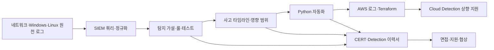

# 보안관제 3년차 이직을 위한 상세 공부 순서

- 기준일: 2026-09-26
- 현재 경력: 보안관제 2년 4개월
- 준비 기간: 약 8개월, 주 최대 20시간
- 현재 연봉: 3,200만 원
- 1차 이직 목표: 4,500만~5,000만 원
- 도전 범위: 5,000만~5,500만 원
- 1순위 직무: 인하우스 CERT·Security Analyst
- 2순위 직무: Detection·SIEM Analyst/Engineer
- 3순위 직무: Cloud Security Engineer

이 문서는 과목을 많이 공부하기 위한 목록이 아니다. 현재 관제 경력을 더 높은 분석·탐지 직무로 연결하기 위해 무엇을 먼저 배우고, 어떤 증거를 만든 뒤, 언제 어느 직무에 지원할지를 정한 실행 순서다.

## 1. 현재 위치와 이직 전략

### 이미 활용할 수 있는 경력

- 4조 3교대 보안관제 2년 4개월
- 2년 이상 일 평균 약 80~100건, 최대 약 180건의 QRadar Offense 처리
- 이벤트와 SIEM 수집 원본 로그의 주요 필드 확인
- 반복 이벤트를 식별하고 로그 소스·출발지·목적지·목적지 포트 조건으로 QRadar 예외 튜닝 직접 적용
- EDR, 방화벽, IPS, WAF, DDoS와 이메일 보안 이벤트 모니터링
- Linux 이상행위 및 AWS·Azure 관련 이벤트 필드 정리·보고
- 신규 인원 약 2명 교육

### 현재 그대로 지원할 때의 약점

- AQL·SPL을 직접 작성한 증거 부족
- Windows·Linux 원천 로그와 직접 조사 명령 부족
- 신규 탐지 룰을 설계·테스트·튜닝한 증거 부족
- 증거 보존, 영향 범위와 재발 방지를 포함한 사고분석 부족
- Python 자동화 결과물 부족
- AWS IAM·CloudTrail·VPC Flow Logs·GuardDuty 조사 경험 부족
- 일일보고서가 독립 분석보다 복사·붙여넣기 중심

따라서 현재 경력을 버리고 완전히 다른 분야로 이동하지 않는다. `QRadar 운영 경험` 위에 `원천 로그 조사 → 탐지 작성 → 사고 분석 → 자동화 → 클라우드 로그`를 순서대로 쌓는다.

## 2. 왜 이 순서로 공부하는가



순서를 바꾸면 다음 문제가 생긴다.

- 원천 로그를 모른 채 SIEM 쿼리를 외우면 필드 의미를 설명하지 못한다.
- 쿼리를 못 쓰는 상태에서 탐지 룰을 만들면 복사한 규칙만 늘어난다.
- 탐지 근거가 약한 상태에서 사고보고서를 쓰면 사실과 추론을 구분하기 어렵다.
- 수동 조사 절차가 없는 상태에서 자동화하면 잘못된 판단을 더 빠르게 반복한다.
- 네트워크·IAM 기초 없이 AWS 보안 서비스부터 외우면 자격증 암기에 머문다.

그러므로 앞 단계의 완료 조건을 통과한 뒤 다음 단계로 간다. 일정이 밀리면 뒤 단계를 억지로 시작하지 않고 핵심 산출물의 범위를 줄인다.

## 3. 공부 우선순위

### 반드시 확보할 핵심 역량

1. Windows·Linux·네트워크 원천 로그 조사
2. SPL·AQL 필터·집계·시간 조건 작성
3. 탐지 가설, 룰, 정상·악성 테스트와 오탐 튜닝
4. 타임라인, 증거, 영향 범위와 대응 보고서 작성
5. Python으로 CSV·JSON 로그 처리와 테스트 작성
6. 본인이 수행한 내용을 5~10분 동안 구조적으로 설명

### 핵심을 강화하는 확장 역량

1. AWS IAM·VPC·CloudTrail·VPC Flow Logs·GuardDuty
2. Terraform으로 비용 통제형 개인 랩 생성·제거
3. PCAP을 이용한 DNS·TCP·TLS·HTTP 조사
4. 경영진용 1페이지 요약 작성

### 첫 이직 이후로 미룰 항목

- Kubernetes 심화 보안
- 악성코드 리버싱
- 메모리·디스크 포렌식 심화
- 대규모 Kafka·OpenSearch 로그 플랫폼
- 실제 운영 SOAR 구축
- AWS Security Specialty
- 여러 자격증 동시 준비

이 항목은 장기적으로 유용하지만 지금 시작하면 핵심 포트폴리오의 완성도가 낮아질 가능성이 크다.

## 4. Month 2 — 원천 로그와 Python 기초

### 이 단계의 목적

SIEM 화면에 정리된 결과만 보는 습관에서 벗어나 이벤트가 어디서 생성되고 어떤 필드가 조사 근거가 되는지 이해한다. Python은 일반 문법 문제보다 보안 로그를 직접 읽고 검증하는 방식으로 배운다.

### Week 1 — Python 자료구조와 네트워크 흐름

#### 공부 순서

1. `list`, `dict`, `set`, `tuple`의 차이
2. `if`, `for`, 함수와 `return`
3. CSV 읽기와 출발지 IP별 집계
4. DNS→TCP→TLS→HTTP 통신 순서
5. 방화벽 `Allow`와 연결 성공의 차이

#### 실습

- `portfolio/detection_lab`의 합성 로그 생성기 실행
- 집계 결과와 원본 CSV 수동 대조
- 학습 체크포인트 8문항을 자기 말로 답변
- 출발지 IP별 `severity` 집계 기능 직접 추가
- 기존 테스트에 `medium=3`, `high=1` 검증 추가

#### 통과 조건

- 합성 이벤트 12건이 출발지 IP 5개로 집계되는 이유를 설명한다.
- 잘못된 IP를 `NULL`로 바꾸지 않고 거부하는 이유를 설명한다.
- `Counter`, `setdefault`, 반복문의 역할을 코드에서 찾는다.
- 도움 없이 간단한 IP별 건수 집계를 작성한다.

### Week 2 — Windows Security Event와 Sysmon

#### 공부 순서

1. Windows 4624·4625의 로그인 성공·실패 의미
2. Logon Type 2·3·10
3. Windows 4688 프로세스 생성
4. Sysmon의 목적과 Windows 기본 로그와의 차이
5. Sysmon 1·3·11·13
6. 부모→자식 프로세스와 사용자·네트워크 상관관계

#### 실습

- 개인 Windows PC 또는 격리 VM의 이벤트 뷰어 확인
- 개인 실습 이벤트의 사용자, 프로세스, 출발지와 시간 필드 기록
- Windows 원본 필드를 공통 합성 로그 스키마와 매핑
- 로그인 실패 다수 후 성공 시나리오 조사표 작성
- Sysmon 프로세스 생성 이벤트를 가정한 합성 샘플 작성

#### 통과 조건

- Sysmon을 생존 신호라고 설명하는 오개념을 수정한다.
- 4625가 많다는 이유만으로 공격이라고 단정하지 않는다.
- 계정 만료, 서비스 계정 오류, 사용자 오입력과 공격 가능성을 구분할 조사 필드를 제시한다.
- 프로세스 경로, 명령줄, 부모 프로세스, 사용자와 네트워크를 연결해 설명한다.

### Week 3 — Linux 조사와 PCAP

#### 공부 순서

1. `/var/log/auth.log`, `/var/log/secure`, `journalctl`의 차이
2. `ps`, `ss`, `lsof`, `last`, `lastb`, `grep`, `/proc`
3. SSH 로그인 실패·성공 조사 순서
4. Wireshark 캡처 필터와 표시 필터 차이
5. DNS 질의·응답, TCP handshake, TLS와 HTTP
6. `DNS 성공 + TCP Timeout + 방화벽 Allow` 원인 분기

#### 실습

- WSL 또는 개인 Linux VM에서 조사 명령 실행
- 각 명령의 목적, 중요한 열과 다음 조사 항목 기록
- DNS, TCP·TLS, HTTP PCAP 미니 보고서 각 1개
- 네트워크 장애 원인 트리 작성

#### 통과 조건

- SSH 실패 이벤트에서 사용자·출발지·실패 이유·후속 성공·프로세스 순으로 조사한다.
- Ping 실패를 서비스 장애의 확정 증거로 사용하지 않는다.
- 방화벽 허용 이후에도 반환 경로, 호스트 방화벽, 서버 리스닝, 부하와 중간 장비를 확인한다.
- HTTPS를 복호화하지 않아도 볼 수 있는 TCP·TLS 메타데이터를 설명한다.

### Week 4 — 통합과 재평가

#### 공부 순서

1. Windows·Linux·네트워크 이벤트를 동일 시간대로 정규화
2. 공통 필드 사전 완성
3. Python 스크립트 5개 완성
4. 시스템·로그 흐름 구성도 작성
5. Month 2 모의 기술면접

#### Python 스크립트 5개

1. 출발지 IP별 집계
2. 조건별 이벤트 필터링
3. 중복 이벤트 제거
4. 잘못된 행 분리와 오류 이유 기록
5. 시간대 정규화

#### Month 2 통과 조건

- 5개 스크립트에 정상·빈 입력·잘못된 입력 테스트가 있다.
- 문서만 보고 합성 로그 생성과 집계를 다시 실행한다.
- Sysmon, Linux SSH 조사와 HTTPS 가시성을 각각 5분 이내에 설명한다.
- 네트워크·Endpoint·Python 재평가에서 기존 치명적 오개념이 나오지 않는다.

통과하지 못하면 Month 3의 탐지 시나리오를 10개에서 5개로 줄이고 Month 2 약점을 먼저 보완한다.

## 5. Month 3 — SIEM 쿼리와 탐지 엔지니어링

### 이 단계의 목적

QRadar UI 조회와 기존 Offense 처리 경험을 직접 쿼리·상관규칙·테스트 능력으로 바꾼다. 특정 필드를 넓게 예외 처리하는 방식에서 벗어나 탐지 손실을 검증하는 튜닝을 익힌다.

### Week 1 — 쿼리 기본기

#### 공부 순서

1. 필드 선택과 필터
2. 시간 범위
3. `count`, 그룹화와 정렬
4. 출발지·목적지·계정·이벤트 이름별 집계
5. SPL과 AQL 문법 차이

#### 결과물

- 단일 필터 쿼리 5개
- 집계 쿼리 5개
- 같은 질문을 SPL·AQL로 표현한 비교표

### Week 2 — 탐지 시나리오 1~5

1. 로그인 실패 다수 후 성공
2. PowerShell 의심 실행
3. 신규 서비스 생성
4. 의심 DNS
5. SQL Injection 패턴

각 시나리오는 다음 순서로 작성한다.

```text
공격 또는 이상행위 가설
→ 필요한 로그 소스와 필드
→ 정상·악성·경계값 합성 이벤트
→ Sigma
→ SPL
→ AQL
→ 기대 결과 테스트
→ 오탐 조건과 조사 절차
```

### Week 3 — 탐지 시나리오 6~10

6. 로그인 위치 또는 시간 이상
7. 권한 변경
8. 의심 파일 생성
9. 비정상 외부 통신
10. 로깅 또는 보안 설정 변경

실제 회사 정책이나 임계치를 사용하지 않고 합성 조건으로 검증한다.

### Week 4 — 튜닝과 Detection-as-Code

#### 공부 순서

1. 넓은 예외와 좁은 예외의 위험 비교
2. 임계치·시간·계정·자산·프로세스 조건 조합
3. 룰 소유자·사유·만료일·재검토일 기록
4. 변경 전후 정상·악성 테스트
5. Git diff로 변경점 설명

#### Month 3 통과 조건

- Sigma·SPL·AQL 10개씩 작성하고 동일 시나리오와 연결한다.
- 모든 룰에 로그 소스, 필수 필드, ATT&CK, 오탐 조건과 조사 절차가 있다.
- 정상·악성·경계값 테스트와 실패 예시를 기록한다.
- 간단한 필터·집계 쿼리는 빈 화면에서 직접 작성한다.
- 기존 QRadar 튜닝 경험을 `문제→판단→변경→감소 확인→미측정 한계`로 설명한다.

이 단계를 통과하면 Detection·SIEM 직무에 필요한 최소 포트폴리오 골격이 생긴다. 아직 자동화와 심층 사고분석 증거가 없으므로 상향 지원 준비 단계로 본다.

## 6. Month 4 — 침해사고 분석과 독립 보고

### 이 단계의 목적

기본 정오탐 분류에서 벗어나 사실·추론·미확인 사항, 타임라인, 영향 범위, 대응과 재발 방지를 설명하는 CERT형 분석가 증거를 만든다.

### Week 1 — 사고대응 공통 절차

#### 공부 순서

1. 식별
2. 증거 보존
3. 봉쇄
4. 제거
5. 복구
6. 사후조치

#### 결과물

- 증거 수집 목록
- 수집 시각·수집자·해시·인계 기록 양식
- 최초 30분 대응 체크리스트
- 사실·추론·미확인 표시 규칙

### Week 2 — 피싱 계정 탈취 의심

#### 반드시 다룰 내용

- 비정상 로그인
- 세션·토큰 폐기
- 비밀번호·MFA 재설정
- 메일 전달 규칙과 OAuth 앱
- 대량 메일 발송과 수신자 영향 범위
- 유사 피해 계정 확인

공격자 사이트에 계정을 직접 검색하거나 입력하는 행동은 하지 않는다.

### Week 3 — PowerShell 의심 실행

#### 반드시 다룰 내용

- 명령 디코딩
- 부모·자식 프로세스
- 실행 사용자와 권한
- 파일·레지스트리·네트워크 후속 행위
- 격리 전 휘발성 증거
- 정상 관리 스크립트 가능성

### Week 4 — SQL Injection과 보고서 완성

#### 반드시 다룰 내용

- 방화벽, WAF, 웹 서버, 애플리케이션과 DB 로그의 역할
- WAF 차단과 실제 애플리케이션 도달 여부
- HTTP 상태 코드와 응답 내용의 차이
- 데이터 변경, 오류, 인증 우회와 후속 행위
- `200 OK=공격 성공`으로 단정하지 않는 반증

#### Month 4 통과 조건

- 기술 보고서 3개, 경영진용 1페이지 요약 3개, 플레이북 3개를 작성한다.
- 각 보고서에서 사실·추론·미확인 사항을 구분한다.
- 증거 보존과 긴급 봉쇄의 우선순위 충돌을 설명한다.
- 동일 자료로 다른 사람이 결론과 한계를 검토할 수 있다.
- 각 사례를 10분 안에 결론→근거→조사→판단→한계 순으로 설명한다.

이 단계를 통과하면 1순위 인하우스 CERT·Security Analyst 지원의 핵심 기술 증거가 생긴다.

## 7. Month 5 — SOC 반복업무 자동화

### 이 단계의 목적

Python 문법 학습 결과를 실제 분석 흐름에 연결한다. 자동으로 침해 여부를 판정하는 도구가 아니라 반복적인 로그 정리 시간을 줄이고 분석가가 최종 판단하도록 돕는 도구를 만든다.

### Week 1 — 요구사항과 구조 정리

- 입력: 합성 CSV·JSON
- 검증: 필수 필드, IP, 시간, 스키마
- 처리: 필드 매핑, 시간대 정규화, 중복 제거
- 출력: 시간순 이벤트와 Markdown 요약 초안
- 오류: 빈 파일, 잘못된 행, 누락 필드와 API 실패

### Week 2 — 타임라인 생성기

- 여러 로그 소스의 시간을 공통 시간대로 변환
- 중복 이벤트 제거
- 주요 이벤트 정렬
- 원본 이벤트 수와 처리 결과 수 대조
- 오류 행 별도 보존

### Week 3 — IoC 비교와 보고서 초안

- 공개 또는 로컬 IoC 목록 입력
- IP·도메인·해시 형식 검증
- 일치 결과와 원본 이벤트 연결
- 일치가 곧 침해를 의미하지 않는 한계 표시
- Markdown 요약 초안 생성

### Week 4 — 테스트·성능·문서화

- 단위 테스트
- 정상·오류·경계값 테스트
- 동일 샘플의 수동 작업과 실행시간 비교
- 설치·실행·복구·삭제 절차
- 사람이 최종 확인할 체크리스트

#### Month 5 통과 조건

- 한 명령으로 테스트를 실행한다.
- 빈 파일, 누락 필드, 잘못된 행과 중복 이벤트를 안전하게 처리한다.
- README만 보고 다른 사람이 실행할 수 있다.
- 자동화하지 않은 판단 영역을 명시한다.
- 직접 작성한 함수와 테스트를 면접에서 설명한다.

이 단계를 통과하면 `대량 관제 인력`보다 `반복작업을 개선하는 분석가`로 포지셔닝할 수 있다.

## 8. Month 6 — AWS 보안 로그와 Terraform

### 이 단계의 목적

Cloud Security Engineer로 즉시 전환한다고 주장하지 않는다. AWS 로그를 조사할 수 있는 CERT·Detection 분석가 증거를 만들고 장기적인 Cloud Detection 이동 기반을 확보한다.

### Week 1 — VPC·IAM·Terraform 기초

- VPC, 퍼블릭·프라이빗 서브넷과 Route Table
- Internet Gateway와 NAT Gateway
- Security Group과 NACL
- IAM User·Role·Policy와 최소 권한
- Terraform `init`, `plan`, `apply`, `destroy`

### Week 2 — AWS 로그

- CloudTrail: API 활동
- VPC Flow Logs: 네트워크 흐름 메타데이터
- GuardDuty: 관리형 위협 탐지 결과
- 로그 필드 사전과 서비스 간 연결
- 예산 알림과 유료 리소스 목록

### Week 3 — 클라우드 탐지 5개

1. 과도한 권한
2. 비정상 API 활동
3. 공개 스토리지
4. 의심 네트워크 통신
5. 로깅 변경

각 탐지에 정상·악성 테스트, 조사 순서, 오탐 조건과 한계를 포함한다.

### Week 4 — 재현·제거·SAA 판단

- Terraform으로 환경 생성
- 탐지와 로그 검증
- 모든 유료 리소스 제거
- 예상 비용과 실제 비용 확인
- 구성도와 실패 기록 완성
- AWS SAA 모의시험 결과 확인

#### Month 6 통과 조건

- 문서만 보고 환경을 생성·검증·제거한다.
- IAM User·Role·Policy를 구분한다.
- Security Group·NACL 차이를 설명한다.
- CloudTrail·VPC Flow Logs·GuardDuty를 조사 시나리오로 연결한다.
- 모의시험 3회 연속 80%와 P4 완료를 모두 충족할 때만 SAA에 응시한다.

AWS 비용이 걱정되면 실제 리소스 범위를 줄이되 Terraform 코드, 구성도, 로그 샘플 테스트와 제거 절차는 유지한다.

## 9. Month 7 — 이력서·포트폴리오·1차 지원

### Week 1 — 경력 증거 확정

- 정확한 입사일과 경력 기간 확인
- Offense 처리량을 외부 공개 가능한 방식으로 검증할 근거 확인
- QRadar 튜닝 승인·검토 절차와 측정 가능한 전후 수치 확인
- 신규 인원 교육 기간·자료·결과 확인
- 직접 작성한 보고 범위 확인

확인하지 못한 내용은 이력서에서 삭제하거나 `정량 결과 미측정`으로 남긴다.

### Week 2 — 직무별 이력서 3종

#### CERT 이력서 순서

1. QRadar와 다종 보안 이벤트 운영
2. 사고 분석 Casebook
3. 원천 로그·PCAP 조사
4. 대응 플레이북
5. 자동화

#### Detection·SIEM 이력서 순서

1. QRadar 튜닝 경험
2. Sigma·SPL·AQL 10개와 테스트
3. Detection-as-Code
4. Python 자동화
5. 사고분석

#### Cloud Security 이력서 순서

1. AWS Cloud Detection Lab
2. CloudTrail·Flow Logs·GuardDuty 탐지
3. Terraform
4. 기존 SOC 경험

Cloud Security 버전은 상향 지원용이며 실제 AWS 운영경력처럼 표현하지 않는다.

### Week 3 — 포트폴리오 검증과 면접

- 네 프로젝트를 깨끗한 환경에서 다시 실행
- 깨진 명령과 링크 수정
- 프로젝트별 채용 담당자용 1페이지 요약
- 60초 자기소개
- QRadar 튜닝, 탐지 룰, 사고 분석, 자동화와 AWS 랩 답변
- 모의면접 평균 3/5 이상, 치명적 오개념 0개 목표

### Week 4 — 맞춤 지원 20개

- 1순위 인하우스 CERT·Security Analyst 중심
- 2순위 Detection·SIEM 상향 지원 병행
- Cloud Security는 경력요건이 맞는 일부 공고만 지원
- 공고 요구사항과 이력서 문장을 일대일로 연결
- 지원일, 회신, 면접, 탈락 단계와 피드백 기록

## 10. Month 8 — 집중 지원과 협상

### 매주 반복할 순서

1. 지난주 지원 결과와 면접 전환율 확인
2. 탈락 단계별 원인 가설 작성
3. 이력서 상단 요약과 프로젝트 순서 수정
4. 기술 약점 한 가지 보완
5. 맞춤 지원 지속
6. 면접 질문·답변·보완점 기록

### 목표

- 누적 맞춤 지원 40개
- 기술면접 5회 이상
- 최종 제안 2개 이상

이 수치는 보장된 결과가 아니라 지원 병목을 찾기 위한 목표다.

### 지원 데이터에 따른 수정

| 상황 | 해석 | 수정 행동 |
|---|---|---|
| 서류 통과가 거의 없음 | 직무·경력 문장·키워드 또는 증거 연결 문제 | 이력서 상단과 프로젝트 순서 수정, 목표 공고 재선정 |
| 1차 면접에서 반복 탈락 | 기본기·경력 설명 또는 오개념 문제 | 질문을 영역별로 분류하고 해당 실습을 다시 수행 |
| 기술면접 후 탈락 | 분석 깊이·설계·테스트 증거 부족 | 실패 질문과 연결된 프로젝트 테스트·문서 강화 |
| 처우에서 결렬 | 기대 연봉과 직무 가치 근거 불일치 | 기본연봉·수당·성과급·성장성을 분리해 비교 |

## 11. 직무별 지원 가능 시점

### 인하우스 CERT·Security Analyst

- 준비 시작: 현재
- 포트폴리오 지원 가능선: Month 4 완료
- 본격 지원: Month 7
- 핵심 증거: 원천 로그, 사고보고서 3개, 플레이북 3개, QRadar 실무

### Detection·SIEM Analyst/Engineer

- 준비 시작: Month 2
- 포트폴리오 지원 가능선: Month 3 완료
- 경쟁력 강화선: Month 5 자동화 완료
- 본격 지원: Month 7
- 핵심 증거: Sigma·SPL·AQL, 테스트, 튜닝 문서와 Python

### Cloud Security Engineer

- 준비 시작: AWS 기초는 매주 3시간
- 포트폴리오 지원 가능선: Month 6 완료
- 본격 판단: 실제 공고의 AWS 운영경력 요구를 확인한 뒤 결정
- 핵심 증거: Terraform, IAM·VPC, CloudTrail·Flow Logs·GuardDuty

현재 단계에서는 Cloud Security를 주력으로 잡지 않는다. 실무 AWS 운영경력이 없는 상태에서 Cloud Security만 지원하면 현재 SOC 경력의 장점을 충분히 활용하기 어렵다.

## 12. 주간 공부 운영법

### 기본 주 20시간

| 블록 | 횟수 | 내용 |
|---|---:|---|
| 4시간 집중 블록 | 3회 | 포트폴리오 구현·실습·테스트 |
| 2시간 학습 블록 | 3회 | 시스템·네트워크·AWS 기본기 |
| 2시간 정리 블록 | 1회 | 문서·면접 설명·주간 회고 |
| **합계** |  | **20시간** |

### 최소 주 10시간

교대근무로 시간이 부족한 주에는 다음만 지킨다.

1. 현재 월의 핵심 산출물 하나: 6시간
2. AWS SAA 기초: 2시간
3. 테스트·설명·회고: 2시간

다음 주에 30시간을 몰아서 보충하지 않는다. 남은 작업을 다음 주 최우선 항목으로 이동한다.

### 한 번 공부할 때의 순서

1. 20~30분: 공식 영상·문서로 개념 확인
2. 60~90분: 개인 랩·합성 데이터에서 실행
3. 20분: 기대 결과와 실제 결과 대조
4. 10분: 보지 않고 설명
5. 10분: 실패·한계와 다음 행동 기록

## 13. 월별 통과 기준과 중단 규칙

| 시점 | 반드시 할 수 있어야 하는 것 | 못하면 어떻게 할 것인가 |
|---|---|---|
| Month 2 종료 | 원천 로그와 Python 기초 설명 | Month 3 시나리오 수를 줄이고 Month 2 보완 |
| Month 3 종료 | SPL·AQL·Sigma와 테스트 | 사고보고서 시작 전 쿼리·룰 5개 완전 재현 |
| Month 4 종료 | 사고 3건의 근거·영향·대응 설명 | 자동화 범위를 줄이고 보고서 품질 보완 |
| Month 5 종료 | 타임라인 도구 실행·테스트·설명 | AWS 랩 범위를 줄이고 Python 테스트 보완 |
| Month 6 종료 | AWS 환경 생성·로그 조사·제거 | Cloud 지원을 제외하고 CERT·Detection 집중 |
| Month 7 종료 | 이력서 증거 연결과 모의면접 3/5 | 지원 수보다 서류·답변 품질 먼저 수정 |

한 달이 늦어져도 괜찮다. 설명하지 못하는 결과물을 늘리는 것보다 완성된 프로젝트 2~3개가 더 유리하다.

## 14. 자격증 공부 순서

### 현재 선택

- AWS Certified Solutions Architect – Associate 한 종목

### 우선순위

1. 월별 포트폴리오 완료
2. AWS 기초 3시간 유지
3. P4 AWS Cloud Detection Lab 완료
4. 모의시험 3회 연속 80%
5. 기준 충족 시 시험 응시

정보처리기사·정보보안기사 또는 AWS Security Specialty를 동시에 준비하지 않는다. SAA도 포트폴리오를 지연시키면 시험을 연기한다.

## 15. 제안받은 회사를 선택하는 기준

### 연봉 4,500만~5,000만 원 이상

직무가 목표와 연결되면 우선 검토한다. 기본연봉, 고정수당, 교대·온콜수당, 성과급과 계약형태를 분리해 비교한다.

### 연봉 4,000만 원 수준

다음 기술 기회 중 최소 두 가지를 실제 업무로 확보할 수 있을 때만 적극 검토한다.

- SIEM 밖의 원천 로그 직접 접근
- 사고 대응과 영향 범위 조사
- 탐지 룰 직접 작성·테스트·배포
- Python·SOAR 자동화
- AWS·Azure 보안 로그와 클라우드 대응

### 높은 연봉이지만 기존 업무와 동일한 관제

단기 보상과 장기 성장성을 분리해 판단한다. 다시 복사·붙여넣기와 대량 종결만 반복하고 직접 분석·개선 권한이 없다면 1억 목표로 가는 기술 경로가 늦어질 수 있다.

### 면접에서 반드시 확인할 질문

1. 분석가가 SIEM 원본 이벤트 외에 엔드포인트·서버·클라우드 로그에 직접 접근할 수 있는가?
2. 탐지 룰 생성·튜닝·검증을 누가 담당하는가?
3. 사고 발생 시 본인이 직접 수행하는 조사와 조치 범위는 어디까지인가?
4. 반복 업무를 Python 또는 SOAR로 개선할 권한과 환경이 있는가?
5. 교대·온콜 빈도와 별도 수당은 어떻게 되는가?
6. 계약직이면 전환 조건, 평가 기준과 계약 종료 시점은 무엇인가?

## 16. 1억 목표로 이어지는 장기 경로

연봉 1억은 자격증 개수만으로 달성되는 목표가 아니다. 직접 설계·개선·자동화하고 중요한 시스템의 탐지와 대응 결과를 책임지는 경력으로 이동해야 한다.

계획상 시간축은 `첫 이직까지 약 8개월 → 첫 이직 후 실무 소유권 확보 2~4년 → 시니어·플랫폼 단계 2~3년`으로 둔다. 따라서 현재부터 약 5~8년을 장기 계획 구간으로 보되, 이는 연봉 달성을 보장하는 예측이 아니라 필요한 경력 단계를 배치한 목표다.

### 단계 1 — 현재부터 첫 이직까지

- 목표: 인하우스 CERT 또는 Detection·SIEM
- 확보할 것: 원천 로그, 직접 대응, 룰 작성, Python 자동화 중 최소 두 가지
- 연봉 목표: 4,500만~5,000만 원, 도전 5,000만~5,500만 원

### 단계 2 — 첫 이직 후 약 2~4년

- 탐지 룰 운영 전체 생명주기 담당
- 실제 사고의 영향 범위와 재발 방지 책임
- Python·SOAR 자동화의 운영 적용
- AWS 또는 Azure 로그와 Cloud Detection 경험
- 정량 성과: 탐지 품질, 처리시간, 자동화율, 장애·사고 대응 결과

### 단계 3 — Detection Engineer·Cloud Detection·SIEM Platform

- 대규모 로그 플랫폼과 탐지 파이프라인
- 탐지 품질·비용·성능 최적화
- 클라우드 멀티계정 보안
- 배포·롤백·테스트를 포함한 Detection-as-Code
- 시니어 또는 기술 리드 역할

구체적인 연봉과 도달 시점은 회사, 직무, 성과와 채용시장에 따라 달라 보장할 수 없다. 첫 이직에서는 당장의 최고 연봉뿐 아니라 다음 단계의 경력 증거를 만들 권한이 있는지를 함께 본다.

## 17. Codex를 사용하는 순서

### 개념 학습

- 현재 이해를 먼저 작성하고 오개념만 교정받는다.
- 한 번에 질문 3개 이하로 모의면접을 진행한다.
- 한국어 설명과 영문 필드명을 연결한 퀴즈를 만든다.

### 코드·탐지

- 합성 로그와 테스트 케이스 초안을 생성한다.
- 코드 전체를 대신 작성하게 한 경우 반드시 함수별로 설명하고 직접 수정한다.
- 정상·악성·경계값 테스트 누락을 리뷰받는다.
- 실제 회사 로그와 정책은 입력하지 않는다.

### 보고서·이력서

- 사실·추론·미확인 사항의 구분을 검토받는다.
- 경력 문장을 증거 파일과 연결한다.
- 측정하지 않은 수치와 경험은 만들지 않는다.
- 채용 담당자용 요약과 기술 상세를 분리한다.

## 18. 현재 바로 해야 할 순서

현재 위치는 `Month 2 Week 1`이다. 다음 순서 외의 새 과목을 추가하지 않는다.

### 첫 번째 학습 블록

- [ ] `portfolio/detection_lab`의 세 명령 직접 실행
- [ ] `events.csv`와 `src_ip_summary.json` 수동 대조
- [ ] Python 학습 체크포인트 1~3번 답변
- [ ] 실행 오류와 이해되지 않는 코드 기록

### 두 번째 학습 블록

- [ ] 한국어 네트워크 강의에서 TCP/IP·DNS 부분 30분 학습
- [ ] DNS→TCP→TLS→HTTP 흐름을 손으로 작성
- [ ] `Allow + Timeout` 가능한 원인 5개 작성
- [ ] Codex로 오개념만 검토

### 세 번째 학습 블록

- [ ] 출발지 IP별 `severity` 집계 직접 추가
- [ ] 기대값 테스트 추가
- [ ] 전체 테스트 실행
- [ ] 변경한 코드를 3분 동안 설명

### Week 1 종료 판정

- [ ] 합성 로그 집계를 도움 없이 설명
- [ ] Python 자료구조 4종을 로그 예제로 구분
- [ ] TCP·TLS·HTTP 관계를 정확히 설명
- [ ] 코드 변경과 테스트 결과를 Git에 기록

## 19. 최종 원칙

1. 영상 완주보다 실행 결과를 우선한다.
2. 자격증보다 포트폴리오와 설명 능력을 우선한다.
3. 회사 경험을 부풀리지 않고 개인 랩으로 부족한 증거를 만든다.
4. 자동화 전에 수동 조사 절차를 먼저 이해한다.
5. 한 단계의 완료 조건을 통과한 뒤 다음 단계로 간다.
6. 첫 이직에서 연봉과 기술 권한을 함께 본다.
7. 장기 1억 목표는 직접 설계·개선·자동화하는 경력으로 연결한다.
