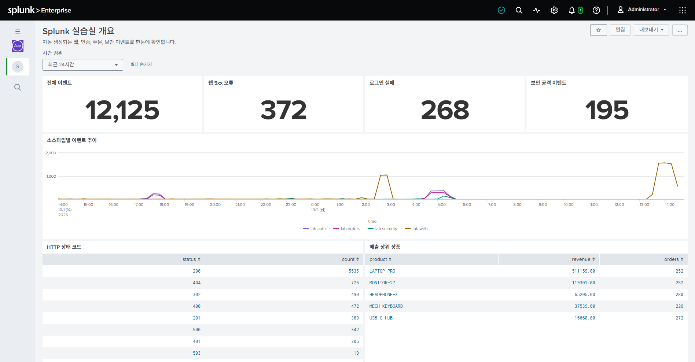
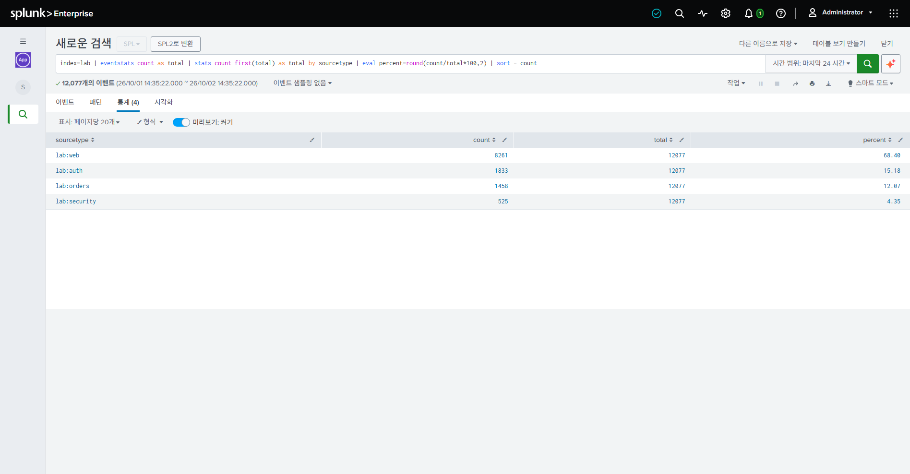
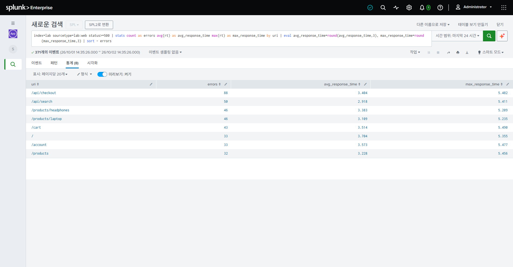
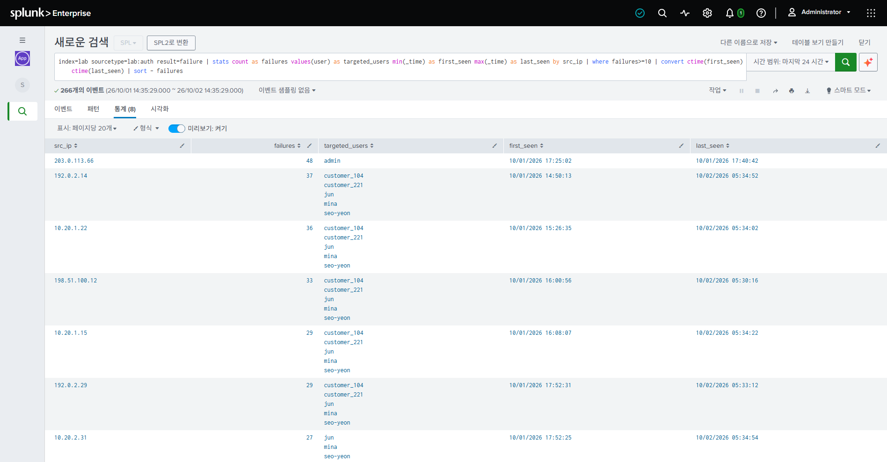
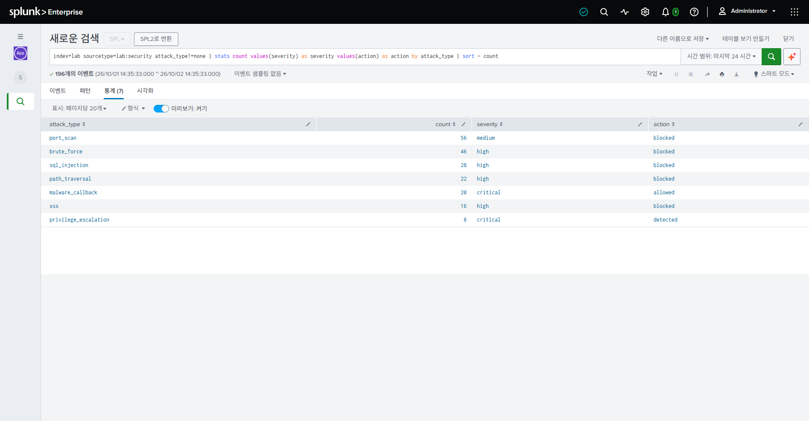
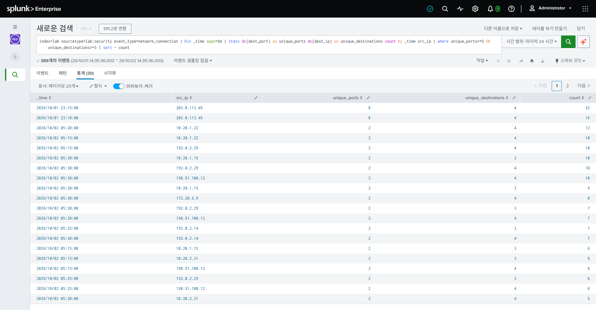
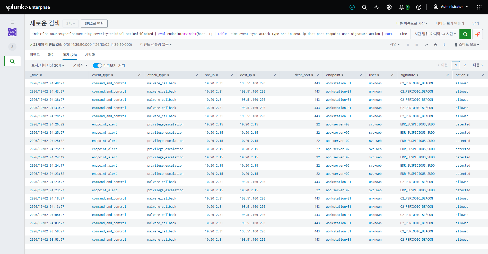
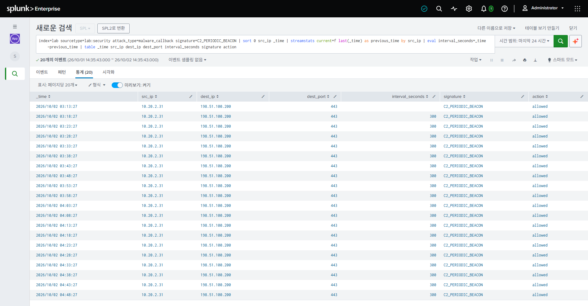

# Splunk 실전 검색·보안 분석 입문

이 문서는 이 저장소의 로컬 Splunk 환경에 직접 접속해 검색한 결과를 바탕으로 작성한 실습서입니다. 화면의 숫자는 로그 생성기가 계속 실행되므로 달라질 수 있지만, 결과의 형태와 분석 방법은 같습니다.

> 모든 IP 주소와 보안 이벤트는 학습을 위해 만든 합성 데이터입니다. 외부 시스템을 공격하거나 실제 악성 트래픽을 발생시키지 않습니다.

## 0. 실습 환경 시작

Docker Desktop을 실행한 뒤 프로젝트 폴더의 PowerShell에서 다음 명령을 실행합니다.

```powershell
.\start.ps1
```

Splunk Web에 접속합니다.

- 주소: <http://localhost:8000>
- 사용자: `admin`
- 비밀번호: `.env` 파일의 `SPLUNK_PASSWORD`
- 앱: **Splunk 실습실**
- 권장 시간 범위: **최근 24시간**

정상적으로 실행되면 다음 대시보드가 표시됩니다.



대시보드의 숫자는 현재 상태를 빠르게 파악하는 지표입니다.

- **전체 이벤트:** 선택한 시간 범위에 포함된 모든 로그
- **웹 5xx 오류:** 서버 내부 오류에 해당하는 HTTP 응답
- **로그인 실패:** 인증에 실패한 이벤트
- **보안 공격 이벤트:** `attack_type`이 `none`이 아닌 보안 탐지 이벤트

## 1. Splunk 데이터 구조 이해

이 실습 환경은 다음 구조로 되어 있습니다.

```text
index=lab
├── sourcetype=lab:web       웹 접근 로그
├── sourcetype=lab:auth      로그인·인증 로그
├── sourcetype=lab:orders    주문 JSON 로그
└── sourcetype=lab:security  IDS·WAF·EDR 형태의 보안 JSON 로그
```

### 꼭 알아야 할 개념

| 개념 | 의미 | 이 실습의 예 |
|---|---|---|
| `index` | 이벤트를 저장하는 논리적 저장 공간 | `lab` |
| `sourcetype` | 로그의 형식과 종류 | `lab:web`, `lab:security` |
| event | Splunk에 저장된 로그 한 건 | 로그인 한 번, HTTP 요청 한 번 |
| field | 이벤트에서 추출한 속성 | `src_ip`, `status`, `attack_type` |
| `_time` | Splunk가 인식한 이벤트 발생 시각 | `2026-10-02 04:48:27` |
| `|` | 앞 단계 결과를 다음 명령에 전달 | 검색 → 집계 → 계산 → 정렬 |

관계형 데이터베이스에 비유하면 `index`는 데이터베이스나 큰 저장 영역과 비슷하지만 완전히 같지는 않습니다. Splunk는 원본 이벤트를 저장하고 검색할 때 필드를 추출하는 방식이 중심입니다.

---

## 2. 실습 1: 데이터 구성 비율 확인

### 목적

현재 어떤 종류의 로그가 얼마나 들어오는지 확인합니다. 분석을 시작할 때 가장 먼저 실행하기 좋은 검색입니다.

```spl
index=lab
| eventstats count as total
| stats count first(total) as total by sourcetype
| eval percent=round(count/total*100, 2)
| sort - count
```



### 한 줄씩 해석

| SPL | 의미 |
|---|---|
| `index=lab` | `lab` 인덱스의 이벤트를 검색 |
| `eventstats count as total` | 전체 이벤트 수를 구해 각 이벤트에 `total` 필드로 추가 |
| `stats ... by sourcetype` | 소스타입별 이벤트 수를 한 행으로 집계 |
| `first(total) as total` | 각 그룹에 들어 있던 동일한 전체 건수 중 하나를 가져옴 |
| `eval percent=...` | 소스타입별 비율을 계산하고 소수점 둘째 자리까지 반올림 |
| `sort - count` | 이벤트가 많은 순서로 정렬. `-`는 내림차순 |

### 결과 읽기

`lab:web`이 가장 많다면 웹 요청 로그가 전체 수집량의 대부분이라는 의미입니다. `lab:security`의 비율이 작더라도 중요도가 낮다는 뜻은 아닙니다. 보안 이벤트는 건수보다 `severity`, `action`, 공격 유형을 함께 봐야 합니다.

---

## 3. 실습 2: 웹 5xx 장애 분석

### 목적

서버 오류가 많이 발생한 URI와 응답 지연을 찾습니다.

```spl
index=lab sourcetype=lab:web status>=500
| stats count as errors avg(rt) as avg_response_time max(rt) as max_response_time by uri
| eval avg_response_time=round(avg_response_time, 3), max_response_time=round(max_response_time, 3)
| sort - errors
```



### 핵심 명령

- `status>=500`: HTTP 상태 코드 500 이상만 필터링합니다.
- `avg(rt)`: 평균 응답 시간을 계산합니다.
- `max(rt)`: 가장 느렸던 요청의 응답 시간을 계산합니다.
- `by uri`: URI별로 결과를 분리합니다.

### 결과 읽기

화면에서는 `/api/checkout`의 오류 수가 가장 많습니다. 오류 수뿐 아니라 평균·최대 응답 시간도 높다면 단순 오류를 넘어 백엔드 지연이나 의존 서비스 장애를 의심할 수 있습니다.

시간대까지 확인하려면 다음 검색을 실행합니다.

```spl
index=lab sourcetype=lab:web status>=500
| timechart span=5m count by uri
```

---

## 4. 실습 3: 무차별 로그인 시도 탐지

### 목적

로그인 실패가 반복된 출발지 IP와 공격 대상 계정을 찾습니다.

```spl
index=lab sourcetype=lab:auth result=failure
| stats count as failures values(user) as targeted_users min(_time) as first_seen max(_time) as last_seen by src_ip
| where failures>=10
| convert ctime(first_seen) ctime(last_seen)
| sort - failures
```



### 핵심 명령

- `values(user)`: 해당 IP가 로그인을 시도한 계정 목록을 만듭니다.
- `min(_time)`, `max(_time)`: 최초·마지막 실패 시각을 구합니다.
- `where failures>=10`: 실패가 10회 이상인 결과만 남깁니다.
- `convert ctime(...)`: Unix 시간을 읽기 쉬운 날짜로 변환합니다.

### 공격과 정상 실패 구분하기

단순히 실패 횟수만 보면 정상 사용자가 많은 IP도 탐지될 수 있습니다. 화면에서 `203.0.113.66`은 짧은 시간 동안 `admin` 한 계정만 집중적으로 공격하지만, 다른 IP는 긴 시간에 걸쳐 여러 계정의 실패가 섞여 있습니다.

짧은 시간에 집중된 공격을 찾도록 개선할 수 있습니다.

```spl
index=lab sourcetype=lab:auth result=failure
| stats count as failures dc(user) as targeted_user_count values(user) as targeted_users min(_time) as first_seen max(_time) as last_seen by src_ip
| eval duration_seconds=last_seen-first_seen
| where failures>=20 AND duration_seconds<=1800
| eval duration_minutes=round(duration_seconds/60, 1)
| convert ctime(first_seen) ctime(last_seen)
| sort - failures
```

`dc(user)`는 서로 다른 대상 계정의 수를 계산합니다. 실제 환경에서는 VPN, 프록시, NAT 환경 때문에 여러 사용자가 하나의 IP로 보일 수 있다는 점도 고려해야 합니다.

---

## 5. 실습 4: 공격 유형별 현황 파악

### 목적

공격 유형별 탐지 수, 심각도, 대응 결과를 한 번에 비교합니다.

```spl
index=lab sourcetype=lab:security attack_type!=none
| stats count values(severity) as severity values(action) as action by attack_type
| sort - count
```



### 필드 의미

| 필드 | 값 | 의미 |
|---|---|---|
| `severity` | `medium`, `high`, `critical` | 이벤트의 위험도 |
| `action` | `blocked` | 보안 장비가 차단함 |
| `action` | `detected` | 탐지했지만 차단 여부는 별도 확인 필요 |
| `action` | `allowed` | 연결이 허용됨. 중요 이벤트라면 우선 조사 대상 |

### 결과 읽기

건수가 가장 많은 공격만 우선 처리하면 안 됩니다. 화면에서 `port_scan`은 탐지 수가 많지만 `medium/blocked`입니다. 반면 `malware_callback`은 건수가 더 적어도 `critical/allowed`이므로 우선순위가 훨씬 높습니다.

실무적인 우선순위 예시는 다음과 같습니다.

```text
critical + allowed  >  critical + detected  >  high + blocked  >  medium + blocked
```

---

## 6. 실습 5: 포트 스캔 탐지

### 목적

한 출발지에서 짧은 시간에 여러 포트나 여러 서버를 탐색한 행동을 찾습니다.

```spl
index=lab sourcetype=lab:security event_type=network_connection
| bin _time span=5m
| stats dc(dest_port) as unique_ports dc(dest_ip) as unique_destinations count by _time src_ip
| where unique_ports>=5 OR unique_destinations>=3
| sort - count
```



### 핵심 명령

- `bin _time span=5m`: 이벤트 시간을 5분 단위 구간으로 묶습니다.
- `dc(dest_port)`: 접근한 서로 다른 목적지 포트 수입니다.
- `dc(dest_ip)`: 접근한 서로 다른 목적지 IP 수입니다.
- `count by _time src_ip`: 시간 구간과 출발지별로 집계합니다.

### 결과 읽기

합성 공격 IP `203.0.113.45`는 5분 안에 8개 포트와 4개 목적지를 탐색합니다. 이는 전형적인 포트 스캔 형태입니다.

현재 조건의 `OR`는 탐지 범위가 넓어 정상 분산 통신도 포함할 수 있습니다. 오탐을 줄이는 연습으로 다음처럼 조건을 강화해 보세요.

```spl
index=lab sourcetype=lab:security event_type=network_connection
| bin _time span=5m
| stats dc(dest_port) as unique_ports dc(dest_ip) as unique_destinations count by _time src_ip
| where unique_ports>=5 AND unique_destinations>=3 AND count>=10
| sort - count
```

---

## 7. 실습 6: 차단되지 않은 중요 공격

### 목적

위험도가 `critical`이면서 차단되지 않은 이벤트를 우선 조사합니다.

```spl
index=lab sourcetype=lab:security severity=critical action!=blocked
| eval endpoint=mvindex(host, -1)
| table _time event_type attack_type src_ip dest_ip dest_port endpoint user signature action
| sort - _time
```



`host`에는 Splunk 수집기 이름과 JSON 내부 호스트명이 함께 들어올 수 있습니다. `mvindex(host, -1)`은 다중값 필드의 마지막 값인 실제 엔드포인트 이름을 `endpoint`로 꺼냅니다. 실무에서는 처음부터 `host`와 `endpoint`처럼 필드 이름을 명확히 분리하는 편이 좋습니다.

### 결과 읽기

검색 결과에는 두 가지 중요한 패턴이 있습니다.

1. `malware_callback / allowed`
   - 내부 호스트 `10.20.2.31`이 외부 주소 `198.51.100.200:443`으로 통신했습니다.
   - 탐지되었지만 허용됐으므로 실제 연결이 성립했을 가능성이 있습니다.
   - 네트워크 격리, 프로세스 확인, DNS·프록시 로그 상관 분석이 필요합니다.

2. `privilege_escalation / detected`
   - `app-server-02`에서 `svc-web` 계정의 의심스러운 권한 상승이 탐지됐습니다.
   - `detected`는 성공 또는 차단을 의미하지 않습니다. EDR 상세 정보와 서버 감사 로그를 확인해야 합니다.

`action!=blocked`는 `allowed`뿐 아니라 `detected`도 포함합니다. 두 상태를 구분하려면 다음처럼 집계합니다.

```spl
index=lab sourcetype=lab:security severity=critical action!=blocked
| eval endpoint=mvindex(host, -1)
| stats count values(signature) as signatures by attack_type action endpoint src_ip dest_ip
| sort action - count
```

---

## 8. 실습 7: C2 비콘 주기 분석

### 목적

감염된 호스트가 명령제어 서버에 일정한 간격으로 연결하는 비콘 패턴을 찾습니다.

```spl
index=lab sourcetype=lab:security attack_type=malware_callback signature=C2_PERIODIC_BEACON
| sort 0 src_ip _time
| streamstats current=f last(_time) as previous_time by src_ip
| eval interval_seconds=_time-previous_time
| table _time src_ip dest_ip dest_port interval_seconds signature action
```



### 핵심 명령

- `sort 0 src_ip _time`: 모든 결과를 IP와 시간 순서로 정렬합니다. `0`은 결과 개수 제한 없이 정렬한다는 뜻입니다.
- `streamstats`: 이벤트 순서를 유지하면서 누적·이전 값 계산을 수행합니다.
- `current=f last(_time)`: 현재 이벤트를 제외하고 바로 이전 이벤트 시간을 가져옵니다.
- `_time-previous_time`: 연속된 연결 사이의 초 단위 간격을 계산합니다.

### 결과 읽기

첫 행은 이전 이벤트가 없으므로 `interval_seconds`가 비어 있습니다. 이후 행은 모두 약 `300`초입니다. 내부 호스트가 같은 외부 IP와 포트로 정확히 5분마다 통신하는 규칙성이 보입니다.

규칙적인 통신만으로 악성이라고 단정할 수는 없습니다. 모니터링 에이전트, 업데이트 서비스, 상태 점검도 주기적으로 통신합니다. 다음 정보를 함께 확인해야 합니다.

- 목적지 IP 또는 도메인의 평판
- 해당 연결을 만든 프로세스
- 호스트의 최근 파일 생성과 프로세스 실행
- 같은 목적지로 연결하는 다른 내부 호스트
- 전송량과 통신 시간대

---

## 9. 사고 조사 순서

보안 이벤트를 발견했다면 다음 순서로 범위를 좁힙니다.

```text
전체 현황 확인
  → 심각도와 action으로 우선순위 결정
  → src_ip / dest_ip / user / host 식별
  → 시간순으로 원본 이벤트 확인
  → 인증·웹·보안 로그 상관 분석
  → 정상 행위와 비교해 오탐 판단
```

예를 들어 `203.0.113.66`의 인증 이벤트와 보안 이벤트를 함께 조사할 수 있습니다.

```spl
index=lab src_ip="203.0.113.66" (sourcetype=lab:auth OR sourcetype=lab:security)
| sort 0 _time
| table _time sourcetype event_type attack_type user result reason severity action signature
```

이 검색을 통해 IDS의 무차별 로그인 탐지와 실제 인증 실패 로그가 같은 시각에 발생했는지 비교할 수 있습니다.

## 10. 자주 사용하는 SPL 명령 요약

| 명령 | 용도 | 예시 |
|---|---|---|
| `search` | 이벤트 필터링 | `status>=500` |
| `stats` | 그룹 집계 | `stats count by src_ip` |
| `eventstats` | 원본 이벤트를 유지하며 통계 추가 | `eventstats count as total` |
| `eval` | 새 필드 계산 | `eval percent=count/total*100` |
| `where` | 계산 결과 조건 필터링 | `where failures>=10` |
| `table` | 표시할 필드와 순서 지정 | `table _time src_ip action` |
| `sort` | 결과 정렬 | `sort - count` |
| `bin` | 숫자나 시간을 구간으로 묶기 | `bin _time span=5m` |
| `dc()` | 서로 다른 값의 개수 | `dc(dest_port)` |
| `values()` | 중복을 제거한 값 목록 | `values(user)` |
| `timechart` | 시간 흐름에 따른 통계 | `timechart span=5m count` |
| `streamstats` | 이벤트 순서를 이용한 누적·이전 값 계산 | `last(_time)` |

## 11. 화면 캡처 다시 만들기

Splunk가 실행 중이고 Windows에 Microsoft Edge가 설치되어 있다면 다음 명령으로 문서의 이미지를 현재 데이터 기준으로 다시 만들 수 있습니다.

```powershell
python -B .\tools\capture_splunk.py
```

스크립트는 임시 브라우저 프로필로 로컬 Splunk에 로그인하고 실제 검색을 실행한 뒤 `docs/images`에 PNG 파일을 저장합니다. `.env`의 비밀번호나 로그인 화면은 캡처하지 않습니다.

## 12. 다음 학습 과제

1. `critical + allowed` 이벤트를 탐지하는 Alert 만들기
2. 공격 IP 목록을 Lookup CSV로 관리하기
3. 대시보드에 심각도별 추이와 상위 공격 IP 패널 추가하기
4. 로그인 성공 직전의 반복 실패를 Transaction 또는 Streamstats로 찾기
5. HEC로 직접 JSON 이벤트를 전송하고 검색하기
