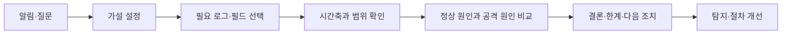
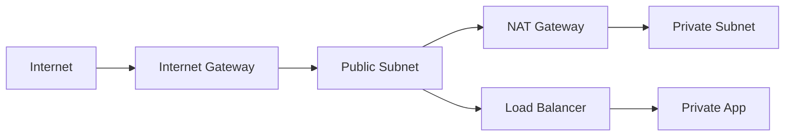

# 보안 분석가 기초 개념서

> 보안관제 경력을 CERT·Detection·Cloud Security 역량으로 확장하기 위한 압축 교재

- 대상: 보안관제 경력 2~3년차, 원천 로그 조사와 직접 쿼리·코딩 경험을 보강하려는 학습자
- 사용 기간: Month 2~6 동안 계속 참고
- 읽는 순서: 네트워크 → Windows → Linux → Python → SIEM·탐지 → 사고대응 → AWS
- 실습 데이터: 공개 자료, 개인 랩, 이 저장소의 합성 데이터만 사용
- 금지 사항: 회사·고객의 실제 로그, IP, 도메인, 계정, 정책, 화면을 저장소에 올리지 않는다.

이 문서는 `career-transition-study-order.md`에 나온 기본 공부를 한 권처럼 읽을 수 있도록 압축한 개념서다. 모든 명령과 이벤트를 외우는 것이 목적이 아니다. 다음 네 질문에 답할 수 있게 되는 것이 목적이다.

1. 무슨 일이 발생했는가?
2. 어떤 로그와 필드가 그 판단을 뒷받침하는가?
3. 다른 정상 원인으로도 설명할 수 있는가?
4. 다음에 무엇을 확인하거나 조치해야 하는가?

## 빠른 목차

1. [공부 방법](#0-이-책을-공부하는-방법)
2. [네트워크](#part-1-네트워크)
3. [Windows와 Endpoint](#part-2-windows와-endpoint)
4. [Linux](#part-3-linux)
5. [Python으로 로그 다루기](#part-4-python으로-로그-다루기)
6. [SIEM 쿼리와 탐지](#part-5-siem-쿼리와-탐지)
7. [사고대응과 보고](#part-6-사고대응과-보고)
8. [AWS와 Terraform](#part-7-aws와-terraform)
9. [통합 조사 연습](#part-8-통합-조사-연습)
10. [4주 기초 학습 루트](#part-9-4주-기초-학습-루트)
11. [면접용 답변 구조](#part-10-면접용-핵심-답변-구조)
12. [압축 용어집](#part-11-압축-용어집)
13. [공식 학습 자료](#part-12-공식-학습-자료)
14. [완료 확인표](#part-13-완료-확인표)

---

## 0. 이 책을 공부하는 방법

### 0.1 읽기만 하면 실력이 되지 않는다

각 절을 다음 순서로 공부한다.

```text
개념 20분
→ 합성 로그·개인 랩 확인 30분
→ 명령 또는 코드 직접 실행 30분
→ 결과를 자기 말로 5줄 기록 10분
→ 확인 문제에 자료 없이 답변 10분
```

모르는 용어가 나올 때마다 깊게 파고들면 진도가 멈춘다. 본문에서 `심화`로 표시한 항목은 존재와 목적만 이해하고 넘어간다.

### 0.2 사실, 추론, 미확인을 분리한다

좋은 분석은 확신에 찬 문장이 아니라 근거의 강도를 구분하는 문장이다.

| 구분 | 의미 | 예시 |
|---|---|---|
| 사실 | 로그나 증거로 직접 확인 | `10:03에 계정 A의 로그인 실패 20건이 기록됨` |
| 추론 | 여러 사실을 연결한 해석 | `비밀번호 추측 시도일 가능성이 있음` |
| 미확인 | 현재 자료로 판단 불가 | `로그인 성공 뒤 실제 권한 사용 여부는 미확인` |

`탐지됨 = 공격`, `차단됨 = 안전`, `200 OK = 침해 성공`으로 단정하지 않는다.

### 0.3 모든 조사는 시간축으로 묶는다

보안 로그는 서로 다른 장비에서 생성된다. 먼저 다음 항목을 확인한다.

- 이벤트가 발생한 시각과 로그가 수집된 시각
- UTC인지 KST인지, 시간대 정보가 없는지
- 장비 시계가 정확한지
- 동일 사용자를 계정명·SID·이메일 중 무엇으로 연결할지
- 동일 장비를 hostname·IP·asset ID 중 무엇으로 연결할지

시간이 틀리면 정상 로그인 뒤의 실패를 실패 뒤의 성공으로 오해할 수 있다.

### 0.4 분석의 기본 반복문



---

# Part 1. 네트워크

## 1. 통신을 한 문장으로 설명하기

브라우저에서 `https://example.test/login`을 입력했다고 가정하자.

```text
DNS로 목적지 IP 확인
→ 목적지까지 라우팅
→ TCP 연결 수립
→ TLS 암호화 세션 수립
→ HTTP 요청 전송
→ HTTP 응답 수신
```

HTTPS는 `HTTP로 443 포트에 접근`하는 것이 아니라, 일반적으로 `TCP 위에 TLS를 수립하고 그 암호화된 통로 안에서 HTTP를 사용`하는 구조다. HTTP/3은 UDP 기반 QUIC를 사용하므로 예외가 있지만, 첫 학습에서는 위의 TCP 흐름부터 확실히 이해한다.

## 2. 계층과 캡슐화

네트워크 계층은 각 장비가 어떤 정보를 볼 수 있는지 설명하는 지도다.

| 범위 | 대표 정보 | 보안 장비가 보는 예 |
|---|---|---|
| Ethernet | MAC 주소, EtherType | 같은 LAN 구간의 통신 |
| IP | 출발지·목적지 IP, TTL, protocol | 방화벽, 라우터 |
| TCP·UDP | 포트, TCP flag, sequence | 방화벽, NDR |
| TLS | SNI, 인증서, 버전, 암호군 | 프록시, NDR |
| HTTP | method, URL, header, body, status | WAF, 웹 로그 |

상위 데이터는 하위 계층의 payload 안에 들어간다. 이를 캡슐화라고 한다.

```text
[Ethernet [IP [TCP [TLS [HTTP]]]]]
```

암호화된 HTTPS에서 일반 방화벽은 보통 IP, 포트, 전송량, 시간, TCP 상태 같은 메타데이터를 볼 수 있다. HTTP URL·본문은 TLS 종료 지점이나 복호화 장비, 서버 로그가 있어야 확인할 수 있다.

## 3. IP, 서브넷, 게이트웨이

### 3.1 IP 주소

IPv4는 32비트 주소다. `192.168.10.25`처럼 네 개의 숫자로 표시한다.

대표 사설 IPv4 범위는 다음과 같다.

- `10.0.0.0/8`
- `172.16.0.0/12`
- `192.168.0.0/16`

사설 IP는 인터넷에서 직접 라우팅되지 않으며, 외부 통신에는 보통 NAT가 사용된다.

### 3.2 CIDR과 서브넷

`192.168.10.0/24`에서 `/24`는 앞의 24비트가 네트워크 부분이라는 뜻이다. 이 범위는 보통 `192.168.10.0`부터 `192.168.10.255`까지 포함한다.

분석가에게 필요한 최소 능력은 다음과 같다.

- 두 IP가 같은 서브넷인지 대략 판단
- 사설·공인·loopback 주소 구분
- `/32`는 단일 IPv4 주소라는 점 이해
- 탐지 조건의 CIDR이 지나치게 넓지 않은지 확인

### 3.3 게이트웨이와 라우팅

목적지가 같은 서브넷이면 호스트는 ARP로 상대 MAC 주소를 찾는다. 다른 네트워크면 기본 게이트웨이의 MAC 주소로 프레임을 보내고, 라우터는 Route Table을 보고 다음 경로를 선택한다.

따라서 DNS가 성공해도 다음 문제로 연결이 실패할 수 있다.

- 목적지까지 가는 route가 없음
- 반환 경로가 다르거나 없음
- 중간 방화벽·보안장비 차단
- 목적지 호스트 방화벽 차단
- 서버가 해당 포트에서 listen하지 않음
- 서버 또는 네트워크 과부하

## 4. MAC과 ARP

IP가 논리적 목적지 주소라면 MAC은 같은 네트워크 구간에서 프레임을 전달할 때 쓰는 주소다. ARP는 IPv4 주소에 대응하는 MAC 주소를 찾는다.

```text
누가 192.168.10.1을 가지고 있는가?
→ 192.168.10.1은 MAC aa:bb:cc:dd:ee:ff이다.
```

ARP 정보는 같은 브로드캐스트 영역에서만 직접 의미가 있다. 인터넷 원격 서버의 MAC 주소를 내 PC가 알아내는 것은 아니다. 다른 네트워크로 갈 때는 기본 게이트웨이의 MAC을 사용한다.

## 5. DNS

DNS는 이름을 IP 등 여러 정보로 해석한다.

| 레코드 | 목적 |
|---|---|
| A | 이름을 IPv4 주소로 연결 |
| AAAA | 이름을 IPv6 주소로 연결 |
| CNAME | 별칭을 다른 이름으로 연결 |
| MX | 메일 서버 지정 |
| TXT | 문자열 정보, 이메일 검증 등에 사용 |
| NS | 권한 있는 네임서버 지정 |

DNS 조사에서는 다음을 구분한다.

- 질의 자체를 보내지 못함
- DNS 서버에 질의했지만 응답이 없음
- `NXDOMAIN`: 이름이 존재하지 않음
- 응답은 받았지만 잘못된 IP 또는 오래된 cache
- 정상 IP를 받은 뒤 TCP 연결에서 실패

Windows에서는 `Resolve-DnsName`, Linux에서는 `dig` 또는 `host`로 확인할 수 있다.

```powershell
Resolve-DnsName example.com
Test-NetConnection example.com -Port 443
```

```bash
dig example.com
curl -v https://example.com/
```

## 6. TCP와 UDP

### 6.1 TCP 3-way handshake

TCP 연결은 보통 다음 흐름으로 시작한다.

```text
Client → Server: SYN
Server → Client: SYN, ACK
Client → Server: ACK
```

주요 flag의 의미:

| Flag | 의미 |
|---|---|
| SYN | 연결 시작, sequence 동기화 |
| ACK | 상대 데이터·요청 수신 확인 |
| FIN | 정상적인 연결 종료 요청 |
| RST | 연결을 즉시 재설정·거절 |

`SYN`을 여러 번 보냈지만 `SYN, ACK`가 돌아오지 않으면 네트워크 차단, 반환 경로 문제, 서버 미응답 등을 의심한다. `RST`가 오면 목적지에 도달했지만 해당 포트가 닫혔거나 중간 장비가 거절했을 수 있다.

### 6.2 UDP

UDP는 TCP처럼 연결을 먼저 수립하지 않는다. 오버헤드가 작지만 전달·순서·재전송을 프로토콜 자체가 보장하지 않는다. DNS, 스트리밍, QUIC 등에서 사용된다.

`UDP 로그가 Allow`라는 사실만으로 상대 애플리케이션이 요청을 처리했다고 말할 수 없다.

### 6.3 포트와 소켓

포트는 한 호스트 안에서 어느 애플리케이션과 통신할지 구분한다. 소켓은 보통 protocol, source IP·port, destination IP·port 조합으로 식별한다.

서버가 `0.0.0.0:443`에서 listen하면 여러 인터페이스에서 연결을 받을 수 있다. `127.0.0.1:443`만 listen하면 같은 호스트에서만 접근 가능하다.

## 7. NAT

NAT는 패킷의 주소나 포트를 변환한다.

- SNAT: 출발지 주소를 변환. 내부 사용자가 인터넷으로 나갈 때 흔하다.
- DNAT: 목적지 주소를 변환. 외부 요청을 내부 서버로 전달할 때 흔하다.
- PAT: 여러 내부 연결을 하나의 공인 IP와 서로 다른 포트로 구분한다.

NAT 환경에서는 원본 출발지와 변환 후 출발지가 다르다. 방화벽·프록시·서버 로그를 연결할 때 NAT 전후 필드와 시각이 필요하다.

## 8. TLS와 HTTPS 가시성

TLS는 서버 인증, 암호화 키 합의, 데이터 무결성과 기밀성을 제공한다. 단순화한 흐름은 다음과 같다.

```text
ClientHello(SNI, 지원 버전 등)
→ ServerHello + 인증서
→ 인증서 검증과 키 합의
→ 암호화된 application data
```

인증서에서 확인할 항목:

- 접속한 이름과 인증서 이름이 일치하는가?
- 유효기간이 지났는가?
- 신뢰할 수 있는 CA 체인인가?
- 중간 인증서가 누락되었는가?

복호화하지 않아도 일반적으로 볼 수 있는 정보는 IP, 포트, 패킷 크기·시각, TCP 상태, TLS 버전, 인증서, 일부 환경의 SNI 등이다. TLS 1.3과 ECH 같은 기술, 장비 위치에 따라 가시성은 달라진다.

## 9. HTTP

HTTP 요청은 method, path, header, body로 구성된다.

| Method | 일반적 목적 |
|---|---|
| GET | 자원 조회 |
| POST | 데이터 제출·처리 요청 |
| PUT | 자원 전체 생성·교체 |
| PATCH | 자원 일부 변경 |
| DELETE | 자원 삭제 |

상태 코드 계열:

- `2xx`: 요청 처리 성공 계열
- `3xx`: 리다이렉션
- `4xx`: 클라이언트 요청 문제·권한 문제
- `5xx`: 서버 처리 오류

`200 OK`는 HTTP 요청이 처리되었다는 뜻이지, SQL Injection이 성공해 DB 데이터가 유출되었다는 뜻이 아니다. 응답 본문, 애플리케이션·DB 로그, 데이터 변경, 후속 행위를 함께 봐야 한다.

URL 예시 `https://shop.example.test/login?id=1`:

- scheme: `https`
- host: `shop.example.test`
- path: `/login`
- query parameter: `id=1`

## 10. 보안 장비가 보는 범위

| 장비 | 주 관찰 범위 | 대표 판단 | 한계 |
|---|---|---|---|
| 방화벽 | IP, port, protocol, session | 허용·차단 | 암호화된 HTTP 내용은 보통 모름 |
| IPS | 패킷·세션과 signature | 알려진 공격 패턴 | 암호화·우회·오탐 영향 |
| WAF | HTTP 요청·응답 | 웹 공격 패턴 | DB 처리 결과를 항상 알 수 없음 |
| Proxy | 사용자와 웹 요청 | URL 통제·기록 | 우회 경로는 관찰 불가 |
| NDR | 네트워크 흐름·패킷 | 이상 통신·행위 | endpoint 내부 행위는 제한적 |
| EDR | process, file, registry, connection | 단말 행위 탐지 | 센서 범위·정책에 의존 |
| SIEM | 여러 소스의 정규화 이벤트 | 상관분석·검색 | 수집되지 않은 사실은 알 수 없음 |

### 핵심 사례: 방화벽 Allow인데 TCP 443 Timeout

`Allow`는 해당 방화벽이 관찰한 패킷을 정책상 통과시켰다는 뜻이다. 연결 성공을 보장하지 않는다.

조사 순서:

1. DNS가 올바른 IP를 반환했는가?
2. 클라이언트 SYN이 나갔는가?
3. 서버의 SYN-ACK가 돌아왔는가?
4. 방화벽 양방향 session·NAT 정보가 있는가?
5. 반환 route가 있는가?
6. 다른 중간 장비나 호스트 방화벽이 막는가?
7. 서버가 443에서 listen하는가?
8. 서버 부하, 연결 한도, TLS handshake 문제인가?

Ping 실패는 ICMP가 차단된 결과일 수도 있으므로 HTTPS 장애의 확정 증거가 아니다.

## 11. Wireshark 최소 사용법

캡처 필터는 패킷을 수집하기 전에 범위를 제한하고, 표시 필터는 수집된 패킷 중 화면에 보일 항목을 고른다.

표시 필터 예시:

```text
dns
tcp.port == 443
ip.addr == 192.0.2.10
tcp.flags.syn == 1
http.request
tls.handshake
```

기본 조사 순서:

1. `Statistics → Protocol Hierarchy`로 구성 확인
2. DNS 질의·응답 확인
3. SYN → SYN/ACK → ACK 확인
4. 재전송·RST 여부 확인
5. TLS handshake와 인증서 확인
6. 평문 HTTP라면 `Follow TCP Stream`으로 요청·응답 확인

`Follow TCP Stream` 내용만 보지 말고 패킷 시각, 방향, flag, retransmission을 함께 본다.

### 네트워크 확인 문제

1. DNS 조회 성공과 웹 접속 성공이 다른 이유는 무엇인가?
2. 방화벽 Allow가 연결 성공을 보장하지 않는 이유는 무엇인가?
3. HTTPS 복호화 없이 확인 가능한 정보 세 가지는 무엇인가?
4. WAF 차단 로그만으로 침해 여부를 확정할 수 없는 이유는 무엇인가?
5. Ping 실패 뒤 바로 서버 장애라고 결론 내리면 안 되는 이유는 무엇인가?

---

# Part 2. Windows와 Endpoint

## 12. Windows 로그를 보는 지도

| 채널 | 주로 확인하는 내용 |
|---|---|
| Security | 로그인, 권한, 프로세스 생성, 감사 정책 관련 이벤트 |
| System | 서비스, 드라이버, 시스템 구성요소 |
| Application | 애플리케이션 오류와 상태 |
| PowerShell Operational | PowerShell 실행 관련 이벤트 |
| Sysmon Operational | 상세 process·network·file·registry·DNS telemetry |

이벤트는 감사 정책이나 로깅 설정이 켜져 있어야 남는다. `로그가 없음`은 `행위가 없음`과 같지 않다.

## 13. 계정, SID, Logon ID

- 계정명은 바뀌거나 같은 이름이 여러 범위에 존재할 수 있다.
- SID는 Windows 보안 주체를 식별하는 값이다.
- Logon ID는 한 로그인 세션과 관련 이벤트를 연결할 때 사용한다.
- 로컬 계정과 도메인 계정을 구분해야 한다.

계정 조사에서는 사용자명 하나만 검색하지 말고 SID, Logon ID, hostname, source IP와 시간을 함께 사용한다.

## 14. 핵심 Windows Event ID

| Event ID | 의미 | 핵심 확인 항목 |
|---:|---|---|
| 4624 | 로그인 성공 | account, Logon Type, source, process, Logon ID |
| 4625 | 로그인 실패 | account, source, failure reason, status, Logon Type |
| 4672 | 새 로그인에 특별 권한 할당 | 어떤 계정·세션인지 |
| 4688 | 새 프로세스 생성 | new process, creator process, command line, user |
| 4697 | 서비스 설치 | service name·path·account |
| 1102 | 감사 로그 삭제 | 실행 계정과 시점 |
| 7045 | System 채널의 서비스 설치 | service name·path·start type |
| 4104 | PowerShell Script Block | 실행된 script 내용과 context |

### 14.1 Logon Type

| Type | 대표 의미 | 예시 |
|---:|---|---|
| 2 | 로컬 대화형 로그인 | 키보드로 PC 로그인 |
| 3 | 네트워크 로그인 | SMB 등 네트워크 접근 |
| 5 | 서비스 로그인 | Windows service |
| 10 | 원격 대화형 로그인 | RDP |

4625가 많아도 공격으로 바로 분류하지 않는다. 만료된 서비스 계정, 저장된 옛 비밀번호, 사용자의 오입력, 구성 오류도 반복 실패를 만든다.

로그인 실패 다수 뒤 성공을 볼 때:

1. 동일 계정인가?
2. 동일 source IP·device인가?
3. 성공의 Logon Type이 실패와 같은가?
4. 성공 뒤 4672, 4688, 네트워크 연결이 이어졌는가?
5. 계정 소유자·업무 시간·자산 중요도와 맞는가?

## 15. 프로세스와 프로세스 트리

프로세스 분석의 핵심 필드:

- image 또는 executable path
- command line
- PID와 PPID
- parent image와 parent command line
- user와 integrity·권한
- hash와 signature
- 시작 시각
- 연결한 IP·domain
- 생성·변경한 file·registry

PID는 재사용될 수 있으므로 PID 하나만으로 장시간의 이벤트를 연결하지 않는다. hostname과 시각을 함께 본다.

정상 여부는 파일 이름 하나가 아니라 문맥으로 판단한다.

```text
평범한 이름의 프로세스
+ 비정상 경로
+ 의심스러운 부모 프로세스
+ 난독화된 command line
+ 외부 연결
= 조사 우선순위 상승
```

## 16. Sysmon

Sysmon은 `자체적으로 살아 있음을 알리는 로그`가 아니다. Windows에 설치되는 시스템 서비스·드라이버로서 상세한 시스템 활동을 Windows Event Log에 기록한다. 무엇이 기록되는지는 Sysmon 구성에 따라 달라진다.

| Sysmon ID | 대표 의미 | 핵심 필드 |
|---:|---|---|
| 1 | Process Create | Image, CommandLine, ParentImage, User, Hashes |
| 3 | Network Connection | Image, source·destination IP·port |
| 11 | File Create | Image, TargetFilename |
| 13 | Registry Value Set | Image, TargetObject, Details |
| 22 | DNS Query | Image, QueryName, QueryResults |

상관분석 예시:

```text
Sysmon 1: powershell.exe 생성
→ Sysmon 22: 새 도메인 질의
→ Sysmon 3: 외부 IP 연결
→ Sysmon 11: 임시 경로에 파일 생성
```

이 흐름만으로 악성이라고 확정하지 않고, command line, 서명, 사용자 업무, 도메인 평판, 파일 hash와 후속 실행을 확인한다.

## 17. 서비스·예약 작업·레지스트리

이 세 기능은 정상 관리에도 쓰이고 지속성 확보에도 쓰인다.

- 서비스: 부팅 시 또는 조건에 따라 백그라운드 실행
- 예약 작업: 시간·이벤트 등 trigger로 프로그램 실행
- Run key 등 레지스트리: 로그인 시 프로그램 실행 가능

조사할 때는 생성자, 생성 시각, 실행 경로, 계정, 서명, 이전 존재 여부를 본다. `신규 서비스 = 악성`이 아니다.

## 18. 기본 PowerShell 조사 명령

```powershell
# 최근 보안 이벤트 조회 예시
Get-WinEvent -FilterHashtable @{LogName='Security'; Id=4624,4625; StartTime=(Get-Date).AddHours(-1)}

# 프로세스와 네트워크 연결
Get-Process
Get-NetTCPConnection

# 서비스 상태
Get-Service
```

실제 조사에서는 관리자 권한, 감사 설정, 로그 보존기간에 따라 결과가 다르다. 개인 PC나 격리 VM에서만 연습한다.

## 19. 격리 전에 생각할 증거

침해 확산이 급하면 즉시 격리가 우선일 수 있다. 다만 격리·종료로 휘발성 정보가 사라질 수 있음을 알아야 한다.

- 현재 프로세스와 process tree
- 현재 network connection과 listening port
- 로그인 사용자와 session
- 메모리 기반 실행 흔적
- 현재 시각과 timezone
- EDR alert·event 식별자
- 관련 file path·hash

분석가가 임의로 디스크를 분리하거나 메모리를 수집하지 않는다. 조직의 승인된 플레이북과 담당 역할을 따른다.

### Windows 확인 문제

1. 4624와 4625는 각각 무엇이며 어떤 필드를 함께 봐야 하는가?
2. Logon Type 3과 10은 어떻게 다른가?
3. Sysmon과 기본 Security 로그의 관계는 무엇인가?
4. PID만으로 이벤트를 연결하면 위험한 이유는 무엇인가?
5. 프로세스 하나를 판단할 때 필요한 문맥 다섯 가지를 말해보라.

---

# Part 3. Linux

## 20. Linux 파일 시스템 지도

| 경로 | 역할 |
|---|---|
| `/` | 전체 파일 시스템의 시작점 |
| `/etc` | 시스템·서비스 설정 |
| `/var` | 로그와 같이 계속 변하는 데이터 |
| `/home` | 일반 사용자 홈 디렉터리 |
| `/tmp` | 임시 파일. 누구나 쓸 수 있는 경우가 많아 조사 대상 |
| `/proc` | process·kernel 정보를 파일처럼 제공하는 가상 파일 시스템 |
| `/usr` | 프로그램과 라이브러리 |
| `/bin`, `/sbin` | 주요 명령. 배포판에 따라 `/usr`로 연결되기도 함 |

경로는 Windows와 달리 대소문자를 구분한다. `/tmp/Update`와 `/tmp/update`는 다른 이름이다.

## 21. 사용자, 그룹, 권한

- UID: 사용자를 식별하는 숫자
- GID: 그룹을 식별하는 숫자
- `root`: 일반적으로 UID 0인 최고 권한 계정
- `sudo`: 정책에 따라 다른 사용자, 흔히 root 권한으로 명령 실행

`rwx`는 read, write, execute 권한을 뜻한다.

```text
-rwxr-x--- 1 alice analysts 1200 Sep 27 10:00 collect.sh
 │││││││││
 owner group others
```

숫자 표기에서는 `r=4`, `w=2`, `x=1`을 더한다. `750`은 owner `rwx`, group `r-x`, others `---`이다.

```bash
id
ls -l
stat ./collect.sh
chmod 750 ./collect.sh
chown alice:analysts ./collect.sh
```

`777`은 문제를 간단히 해결하는 만능값이 아니다. 불필요한 쓰기·실행 권한을 만들 수 있다.

## 22. 프로세스와 서비스

프로세스는 실행 중인 프로그램의 instance다. PID는 프로세스 ID, PPID는 부모 프로세스 ID다.

```bash
ps aux
ps -ef --forest
pgrep -a ssh
readlink -f /proc/1234/exe
tr '\0' ' ' < /proc/1234/cmdline
```

`/proc/<PID>`에서 실행 파일, command line, 열린 file descriptor 등 여러 정보를 볼 수 있지만 권한과 프로세스 종료 여부에 따라 조회가 실패할 수 있다.

systemd 환경의 기본 명령:

```bash
systemctl status ssh
systemctl list-units --type=service
journalctl -u ssh --since "1 hour ago"
journalctl --since "2026-09-27 09:00" --until "2026-09-27 10:00"
```

`systemctl`은 서비스 상태·제어, `journalctl`은 journal 로그 조회에 사용한다.

## 23. Linux 인증과 SSH 로그

배포판과 설정에 따라 로그 위치가 다르다.

- Ubuntu·Debian 계열: 보통 `/var/log/auth.log`
- RHEL 계열: 보통 `/var/log/secure`
- systemd journal: `journalctl -u ssh` 또는 `journalctl -u sshd`

합성 예시:

```text
Sep 27 09:10:01 lab sshd[1200]: Failed password for invalid user admin from 192.0.2.50 port 50123 ssh2
Sep 27 09:12:14 lab sshd[1240]: Accepted publickey for analyst from 198.51.100.25 port 51200 ssh2
```

확인할 필드:

- 성공·실패
- 대상 username과 존재하지 않는 계정 여부
- source IP와 source port
- password·publickey 등 인증 방식
- 실패 이유
- 같은 source·user의 후속 성공
- 성공 뒤 실행 process, sudo, 외부 연결

단순 실패 횟수보다 `짧은 시간의 여러 계정`, `실패 뒤 성공`, `평소와 다른 인증 방식`, `성공 뒤 행위`가 중요하다.

## 24. 로그인 조사 명령

```bash
who
w
last
lastb
lastlog
```

- `who`, `w`: 현재 로그인 session
- `last`: 로그인 history
- `lastb`: 실패 로그인 history. 권한과 파일 설정 필요
- `lastlog`: 사용자별 최근 로그인

이 결과는 완전한 진실 원장이 아니다. 로그 rotation, 삭제, 설정, 컨테이너 환경 등에 영향을 받는다.

## 25. 네트워크 조사 명령

```bash
ip addr
ip route
ss -lntup
ss -ntp
lsof -i
dig example.com
curl -v https://example.com/
```

`ss -lntup`의 의미:

- `l`: listening
- `n`: 이름 해석 없이 숫자로 표시
- `t`: TCP
- `u`: UDP
- `p`: process 정보

연결 조사에서는 local·peer 주소, port, state, process, PID를 확인한다. root 권한이 없으면 일부 process 정보가 보이지 않을 수 있다.

## 26. 로그 필터와 집계

```bash
# 특정 문자열 검색
grep "Failed password" synthetic-auth.log

# 대소문자 무시, 줄 번호 출력
grep -in "failed password" synthetic-auth.log

# 공백 기준 11번째 필드 추출 후 집계하는 단순 예시
awk '/Failed password/ {print $11}' synthetic-auth.log | sort | uniq -c | sort -nr
```

`cut`·`awk`의 필드 번호는 로그 형식이 달라지면 깨질 수 있다. 실습할 때 몇 줄을 눈으로 대조하고, production 자동화에서는 구조화된 형식이나 parser를 우선한다.

Pipe `|`는 앞 명령의 표준 출력을 다음 명령의 표준 입력으로 넘긴다.

```bash
command > result.txt      # 새로 쓰기
command >> result.txt     # 이어 쓰기
command 2> error.txt      # 오류만 쓰기
```

## 27. 파일 조사

```bash
find /tmp -type f -mtime -1
stat /tmp/synthetic.bin
sha256sum /tmp/synthetic.bin
file /tmp/synthetic.bin
```

확인 항목:

- 경로와 파일명
- 크기와 type
- 생성·변경·접근 시각의 의미와 파일 시스템 한계
- owner·group·permission
- hash
- 실행 프로세스와 열린 파일

hash가 같으면 같은 byte content라고 강하게 볼 수 있지만, 공개 평판 조회에서 결과가 없다고 안전한 것은 아니다.

## 28. 예약 실행과 지속성

- cron: 정해진 시간에 명령 실행
- systemd timer: systemd unit과 결합된 예약 실행
- shell profile: 로그인·shell 시작 시 명령 실행 가능
- service unit: 부팅 또는 조건에 따라 실행

조사할 때는 파일 수정 시각, owner, 실행 command, 참조하는 script, 이전 존재 여부를 확인한다. Bash history는 사용자가 끄거나 수정할 수 있고 모든 명령이 기록된다고 보장할 수 없다.

## 29. 시간대 확인

```bash
date
timedatectl
journalctl --utc
```

타임라인에는 원본 시각, 원본 timezone, 변환된 UTC 또는 KST를 구분한다. 문자열 끝의 `Z`는 보통 UTC를 의미한다.

### Linux 확인 문제

1. `/var`, `/etc`, `/proc`는 각각 무엇인가?
2. SSH 실패 로그에서 최소 어떤 필드를 확인해야 하는가?
3. `ss -lntup`은 무엇을 보여주는가?
4. Bash history만으로 사용자 행위를 확정하면 안 되는 이유는 무엇인가?
5. 파일 hash 평판 결과가 없으면 안전하다고 할 수 있는가?

---

# Part 4. Python으로 로그 다루기

## 30. Python 학습의 목표

목표는 개발자 코딩시험이 아니라 다음 반복 작업을 안전하게 줄이는 것이다.

```text
CSV·JSON 읽기
→ 필수 필드와 형식 검증
→ 필터·집계·중복 제거
→ 시간대 정규화
→ 결과와 오류 행 분리
→ 분석가가 최종 판단
```

자동화가 침해 여부를 대신 판단하게 하지 않는다. 입력 검증과 오류 기록이 없는 빠른 script는 잘못된 결론을 빠르게 생산한다.

## 31. 기본 자료형

```python
source_ip = "192.0.2.10"       # str
event_count = 12                # int
risk_score = 7.5                # float
is_blocked = False              # bool
username = None                 # 값이 없음을 명시
```

`None`은 문자열 `"NULL"`이나 빈 문자열과 다르다. 잘못된 IP를 `None`으로 바꾸어 계속 처리하면 오류 데이터가 정상처럼 섞일 수 있다. 거부하거나 오류 행으로 분리하고 이유를 기록한다.

## 32. list, dict, set, tuple

| 구조 | 특징 | 로그 처리 예 |
|---|---|---|
| `list` | 순서 있음, 중복 허용, 변경 가능 | 이벤트 여러 개 저장 |
| `dict` | key-value, 변경 가능 | 이벤트 한 건 또는 IP별 건수 |
| `set` | 중복 없음 | 고유 IP·사용자 추출 |
| `tuple` | 순서 있음, 변경 불가 | 고정된 복합 key |

```python
events = ["login_failed", "login_failed", "login_success"]

event = {
    "timestamp": "2026-09-27T00:10:00Z",
    "source_ip": "192.0.2.10",
    "event_name": "login_failed",
}

unique_ips = {"192.0.2.10", "198.51.100.20"}
group_key = ("alice", "192.0.2.10")
```

`dict`의 key와 `set`의 원소에는 hash 가능한 값이 필요하다. `list`는 변경 가능해서 key로 쓸 수 없고 `tuple`은 원소도 hash 가능하면 사용할 수 있다.

## 33. 조건문과 반복문

```python
severity = "high"

if severity == "high":
    priority = 1
elif severity == "medium":
    priority = 2
else:
    priority = 3
```

```python
counts = {}

for event in events:
    source_ip = event["source_ip"]
    counts[source_ip] = counts.get(source_ip, 0) + 1
```

- `break`: 반복 전체 종료
- `continue`: 현재 회차만 건너뜀
- `while`: 조건이 참인 동안 반복. 종료 조건을 명확히 작성

## 34. 함수와 return

함수는 하나의 명확한 역할을 갖게 한다.

```python
import ipaddress


def validate_ip(value: str) -> str:
    """유효한 IP 문자열을 반환하고, 잘못되면 예외를 발생시킨다."""
    return str(ipaddress.ip_address(value))
```

`print`는 화면 출력이고 `return`은 호출한 코드에 값을 돌려준다. 테스트와 재사용을 위해 처리 함수에서는 값을 반환하고, 사용자 출력은 바깥에서 담당하는 편이 좋다.

## 35. 문자열 처리

```python
line = "alice,192.0.2.10,login_failed"
username, source_ip, event_name = line.split(",")
summary = f"{username} 계정에서 {event_name} 발생"
joined = " | ".join([username, source_ip, event_name])
```

실제 CSV는 따옴표 안의 쉼표, 줄바꿈 등이 있을 수 있으므로 `split(",")` 대신 표준 `csv` 모듈을 사용한다.

## 36. 파일, CSV, JSON

`with`를 사용하면 오류가 나도 파일을 닫기 쉽다.

```python
from pathlib import Path

path = Path("data/synthetic/events.txt")

with path.open("r", encoding="utf-8") as handle:
    content = handle.read()
```

CSV 읽기:

```python
import csv


def read_events(path: str) -> list[dict[str, str]]:
    with open(path, "r", encoding="utf-8", newline="") as handle:
        return list(csv.DictReader(handle))
```

JSON 읽고 쓰기:

```python
import json

with open("events.json", "r", encoding="utf-8") as handle:
    events = json.load(handle)

with open("summary.json", "w", encoding="utf-8") as handle:
    json.dump(events, handle, ensure_ascii=False, indent=2)
```

JSON 전체 문서와 JSON Lines는 다르다. JSON Lines는 한 줄에 JSON object 하나를 저장하여 큰 로그를 순차 처리하기 쉽다.

## 37. 오류 처리와 거부 행

```python
def normalize_event(row: dict[str, str]) -> dict[str, str]:
    required = {"timestamp", "source_ip", "event_name"}
    missing = required - row.keys()
    if missing:
        raise ValueError(f"missing fields: {sorted(missing)}")

    return {
        "timestamp": row["timestamp"],
        "source_ip": validate_ip(row["source_ip"]),
        "event_name": row["event_name"].strip(),
    }
```

```python
accepted = []
rejected = []

for row_number, row in enumerate(rows, start=2):
    try:
        accepted.append(normalize_event(row))
    except (KeyError, ValueError) as exc:
        rejected.append({
            "row_number": row_number,
            "reason": str(exc),
            "row": row,
        })
```

`except Exception: pass`처럼 모든 오류를 조용히 무시하지 않는다. 어느 행이 왜 실패했는지 기록한다. 비밀값이나 실제 회사 로그 전체를 오류 메시지에 남기지 않는다.

## 38. Counter와 복합 key

```python
from collections import Counter

counts = Counter(event["source_ip"] for event in events)
```

심각도까지 묶으려면 tuple key를 사용할 수 있다.

```python
counts = Counter(
    (event["source_ip"], event["severity"])
    for event in events
)
```

코드가 짧다는 이유보다 입력과 출력이 무엇인지 설명할 수 있는지가 중요하다.

## 39. 시간 처리

```python
from datetime import datetime, timezone

raw = "2026-09-27T09:10:00+09:00"
parsed = datetime.fromisoformat(raw)
utc_time = parsed.astimezone(timezone.utc)
print(utc_time.isoformat())
```

시간대 정보가 없는 naive datetime을 임의로 UTC라고 가정하지 않는다. 데이터 사전에서 원본 시간대가 무엇인지 확인한다.

## 40. 정규표현식

정규표현식은 문자열 pattern 검색 도구다.

```python
import re

pattern = re.compile(r"Failed password for (?:invalid user )?(\w+) from ([0-9.]+)")
match = pattern.search(synthetic_line)

if match:
    username, source_ip = match.groups()
```

정규표현식으로 IP처럼 보이는 문자열을 찾았다고 유효한 IP인 것은 아니다. 추출 뒤 `ipaddress.ip_address()`로 검증한다. 로그 형식이 안정적이면 공식 parser나 구조화 필드를 우선한다.

## 41. argparse, logging, main

```python
import argparse
import logging


def parse_args():
    parser = argparse.ArgumentParser()
    parser.add_argument("input", help="합성 CSV 입력 경로")
    return parser.parse_args()


def main() -> int:
    args = parse_args()
    logging.basicConfig(level=logging.INFO)
    logging.info("processing %s", args.input)
    return 0


if __name__ == "__main__":
    raise SystemExit(main())
```

`if __name__ == "__main__"` 블록을 사용하면 파일을 직접 실행할 때만 `main()`을 호출하고, 테스트에서 import할 때 자동 실행되지 않게 할 수 있다.

## 42. 테스트

최소 세 종류를 확인한다.

- 정상값: 기대한 결과가 나오는가?
- 오류값: 잘못된 IP, 누락 필드를 안전하게 거부하는가?
- 경계값: 빈 파일, 한 행, 중복, 시간 경계는 어떻게 처리하는가?

```python
import unittest


class ValidateIpTest(unittest.TestCase):
    def test_valid_ipv4(self):
        self.assertEqual(validate_ip("192.0.2.10"), "192.0.2.10")

    def test_invalid_ip(self):
        with self.assertRaises(ValueError):
            validate_ip("999.1.1.1")
```

테스트 통과만 확인하지 말고, 일부러 구현을 깨뜨렸을 때 테스트가 실패하는지도 확인한다.

## 43. 가상환경과 의존성

```powershell
python -m venv .venv
.\.venv\Scripts\Activate.ps1
python -m pip install -r requirements.txt
python -m unittest discover -s tests -v
```

가상환경은 프로젝트별 package를 분리한다. API key와 password는 코드·Git에 넣지 않고 환경변수나 승인된 secret 저장소를 사용한다.

### Python 확인 문제

1. `list`, `dict`, `set`, `tuple`의 차이는 무엇인가?
2. `print`와 `return`의 차이는 무엇인가?
3. 잘못된 IP를 `NULL`로 바꿔 계속 처리하면 어떤 문제가 생기는가?
4. `with`로 파일을 여는 이유는 무엇인가?
5. 정상·오류·경계값 테스트의 예를 하나씩 말해보라.

---

# Part 5. SIEM 쿼리와 탐지

## 44. SIEM이 하는 일

SIEM은 여러 로그를 수집·정규화·검색·상관분석하고 alert나 offense를 만든다.

```text
로그 생성
→ 수집 agent·collector
→ parsing·정규화
→ 저장·index
→ query·correlation rule
→ alert/offense
→ 분석가 조사
```

각 단계에서 데이터가 빠지거나 바뀔 수 있다.

- 장비에서 로그가 생성되지 않음
- 수집 구간 장애
- parser가 필드를 잘못 추출
- 시간대가 잘못 적용
- field mapping이 서로 다름
- rule 조건이 잘못되거나 예외가 너무 넓음

SIEM 화면의 필드와 raw log를 비교하는 습관이 필요하다.

## 45. 공통 필드 사전

제품마다 필드명이 다르므로 의미 기준의 공통 schema를 만든다.

| 공통 의미 | 예시 필드 |
|---|---|
| 이벤트 시각 | `timestamp`, `_time`, `starttime` |
| 수집 시각 | `ingest_time` |
| 로그 소스 | `log_source`, `sourcetype`, `device_type` |
| 출발지 | `source_ip`, `src_ip` |
| 목적지 | `destination_ip`, `dst_ip` |
| 사용자 | `username`, `user`, `account_name` |
| 장비 | `hostname`, `device_name`, `asset_id` |
| 행위 | `event_name`, `action`, `event_id` |
| 결과 | `result`, `status`, `outcome` |
| 프로세스 | `process_name`, `image`, `command_line` |

필드가 없다는 것과 값이 null인 것을 구분한다. `source_ip`가 proxy IP인지 원본 client IP인지 데이터 사전에 적는다.

## 46. 쿼리의 네 가지 기본 동작

1. 시간 범위 제한
2. 필요한 이벤트 필터
3. 의미 있는 key로 그룹화·집계
4. 빈도·시각순으로 정렬

합성 schema를 가정한 SPL 예시:

```spl
index=lab event_name="login_failed"
| stats count min(_time) AS first_seen max(_time) AS last_seen
  BY username source_ip
| where count >= 5
| sort - count
```

개념상 동일한 AQL 예시:

```sql
SELECT username, sourceip,
       COUNT(*) AS event_count,
       MIN(starttime) AS first_seen,
       MAX(starttime) AS last_seen
FROM events
WHERE eventname = 'login_failed'
GROUP BY username, sourceip
HAVING COUNT(*) >= 5
ORDER BY event_count DESC
LAST 1 HOURS
```

실제 QRadar field·function 이름은 설치 버전과 custom property에 따라 다를 수 있다. 자신의 합성 데이터와 공식 문서로 검증한다.

## 47. 검색과 탐지는 다르다

- 검색: 이미 알고 싶은 질문을 데이터에 질의
- 탐지: 특정 위험 가설을 지속적으로 찾아 알림 생성

좋은 탐지는 단순한 공격 문자열이 아니라 다음 구조를 가진다.

```text
가설
→ 필요한 telemetry
→ 논리와 시간 창
→ 정상·악성·경계값 test
→ 오탐 분석
→ 조사 절차
→ owner·변경 이력
```

## 48. 탐지 규칙에 반드시 들어갈 내용

1. 규칙 이름과 목적
2. 공격·이상행위 가설
3. 로그 소스와 필수 field
4. 탐지 논리와 threshold·time window
5. MITRE ATT&CK technique mapping
6. 정상·악성·경계값 test
7. 알려진 false positive 조건
8. 분석가 조사 순서
9. 한계와 탐지 사각지대
10. owner, version, 검토일

ATT&CK mapping은 품질 도장이 아니다. 규칙이 실제로 관찰하는 행위와 직접 연결되는 technique만 선택하고 이유를 적는다.

## 49. 예시: 로그인 실패 다수 후 성공

### 가설

짧은 시간에 동일 계정 또는 동일 source에서 다수의 로그인 실패 뒤 성공하면 password 추측이나 credential 오용 가능성이 있다.

### 필요한 로그와 필드

- 인증 로그
- timestamp, username, source IP, destination, result, logon type, authentication method

### 합성 조건

```text
10분 안에 동일 username·destination에서 실패 10건 이상
그리고 그 뒤 5분 안에 성공 1건 이상
```

### false positive 후보

- 계정 password 변경 뒤 저장된 옛 password로 service 재시도
- VPN·메일 client의 자동 재시도
- 사용자 오입력 뒤 정상 성공
- shared NAT로 여러 사용자가 같은 source IP 사용

### 조사 절차

1. 실패와 성공의 정확한 시각·순서 확인
2. source, device, Logon Type, 인증 방식 비교
3. 평소 접속 이력과 자산 중요도 확인
4. 성공 뒤 process, privilege, network, file 행위 확인
5. 계정 잠금·MFA·password 변경 등 대응 필요성 판단

## 50. 튜닝과 예외의 원칙

오탐을 줄인다는 이유로 `source IP 전체 제외`처럼 넓은 예외를 만들면 같은 source의 실제 공격도 사라질 수 있다.

안전한 튜닝 질문:

1. 정상이라고 판단한 근거가 있는가?
2. 어떤 field 조합이 정상 행위를 유일하게 설명하는가?
3. 예외가 숨길 수 있는 악성 test를 실행했는가?
4. 만료일과 재검토일이 있는가?
5. 변경 전후 alert 수와 탐지 손실을 측정했는가?

예외는 `log source + source + destination + port`만으로 끝내지 않고, 가능하면 process, user, action, protocol, asset role과 시간 조건을 검토한다. 단, 필드 신뢰성이 낮으면 더 정교해 보이는 조건도 안전하지 않다.

## 51. Detection-as-Code

탐지를 파일로 관리하면 version control, review, test와 rollback이 쉬워진다.

```text
detections/
  login_failed_then_success.yml
tests/
  login_failed_then_success/
    benign.jsonl
    malicious.jsonl
    boundary.jsonl
docs/
  investigation-login.md
```

Git diff를 보고 다음을 설명할 수 있어야 한다.

- 무엇을 바꿨는가?
- 왜 바꿨는가?
- 어떤 test로 검증했는가?
- 새로 생긴 blind spot은 무엇인가?

### SIEM·탐지 확인 문제

1. raw log와 normalized field를 비교해야 하는 이유는 무엇인가?
2. 검색과 탐지는 어떻게 다른가?
3. ATT&CK mapping이 규칙 품질을 보장하지 않는 이유는 무엇인가?
4. 넓은 예외가 위험한 이유는 무엇인가?
5. 정상·악성·경계값 test는 각각 무엇을 검증하는가?

---

# Part 6. 사고대응과 보고

## 52. 사고대응의 큰 흐름

사고대응은 상황에 따라 반복되고 동시에 진행된다. 학습을 위해 다음 흐름으로 기억한다.

```text
준비
→ 탐지·분석
→ 봉쇄
→ 제거
→ 복구
→ 사후 개선
```

긴급 봉쇄와 증거 보존이 충돌할 수 있다. 생명·안전·대규모 확산 방지가 우선인 상황도 있고, 법적·규제 목적의 증거 절차가 중요한 상황도 있다. 개인 판단으로 단정하지 말고 조직의 승인 체계와 플레이북을 따른다.

## 53. 최초 30분에 답할 질문

1. 무엇이 alert를 발생시켰는가?
2. 현재도 진행 중인가?
3. 영향을 받는 account·host·service는 무엇인가?
4. privileged asset 또는 중요 데이터와 관련 있는가?
5. 즉시 차단하지 않으면 피해가 커지는가?
6. 차단 전에 보존해야 할 휘발성 증거는 무엇인가?
7. 누가 의사결정권자이며 누구에게 보고해야 하는가?

## 54. 증거 보존의 기초

최소 기록 항목:

- 증거 식별자와 설명
- 수집 출처
- 수집 시각과 timezone
- 수집자
- 수집 방법·tool version
- 원본 보존 위치
- hash
- 전달·접근 이력

업무상 필요한 파일이라고 해서 모두 포렌식 증거는 아니다. 사고 가설과 관련된 process, memory, disk image, logs, account activity, network data 등을 승인된 절차로 수집한다.

## 55. 영향 범위

영향 범위는 `처음 탐지된 PC 한 대`가 아니다.

- 동일 IoC를 가진 다른 host
- 동일 account의 다른 login·session
- 같은 source·destination과 통신한 asset
- 생성·수정된 file과 account
- email 발송·전달 대상
- cloud resource와 API activity
- 최초 발생부터 마지막 확인까지의 시간 범위

범위를 넓힐 때 단순 문자열 일치만 사용하지 말고 시간, 행위와 asset context를 포함한다.

## 56. 피싱 계정 탈취 의심

조사 순서 예시:

1. 원본 message·header와 URL 정보를 안전하게 보존
2. 사용자가 link를 열거나 credential을 제출했는지 확인
3. 계정의 비정상 login, device, location, MFA activity 확인
4. active session·token 폐기 필요성 판단
5. password·MFA reset
6. mailbox forwarding rule, inbox rule, OAuth application 확인
7. 내부·외부 대량 발송과 추가 수신자 영향 확인
8. 유사 피해 account 탐색

피싱 사이트에 실제 credential을 입력하거나 공격자 사이트에서 계정을 직접 검색하지 않는다.

## 57. 의심 PowerShell

확인 항목:

- 전체 command line과 Script Block Log
- encoded·obfuscated 부분
- parent·child process
- 실행 user와 privilege
- file download·creation·execution
- registry·scheduled task·service 변경
- DNS와 external connection
- 정상 관리 script·software deployment 가능성

Base64처럼 보이는 문자열을 디코딩할 때도 실행하지 않는다. 격리된 분석 환경에서 문자열로만 처리한다.

## 58. SQL Injection 의심

로그별 역할:

- 방화벽: 네트워크 session 허용·차단
- WAF: HTTP request pattern과 차단 여부
- web server: 요청 path, status, response size
- application: query 처리와 오류
- DB: 실제 query, account, data read·change

판단 질문:

1. WAF에서 차단했는가, monitor만 했는가?
2. origin application까지 요청이 도달했는가?
3. HTTP status와 response body는 무엇인가?
4. application·DB error 또는 비정상 query가 있는가?
5. data access·change, auth bypass, 후속 행위가 있는가?

`200 OK` 하나만으로 성공·실패를 결정하지 않는다.

## 59. 보고서 쓰는 법

### 기술 보고서

```text
1. 한 줄 결론
2. 탐지 배경과 범위
3. 타임라인
4. 확인된 사실
5. 분석과 대안 가설
6. 영향 범위
7. 수행·권고 조치
8. 미확인 사항과 한계
9. 재발 방지·탐지 개선
```

### 경영진용 1페이지

- 무슨 일이 있었는가?
- 사업 영향은 무엇인가?
- 현재 통제되었는가?
- 남은 위험은 무엇인가?
- 어떤 결정·지원이 필요한가?

기술 용어보다 위험과 의사결정을 중심으로 쓴다.

### 사고대응 확인 문제

1. 격리와 증거 보존이 충돌할 때 무엇을 고려해야 하는가?
2. 영향 범위가 최초 host보다 넓은 이유는 무엇인가?
3. 피싱 account 조사에서 session·token 폐기가 중요한 이유는 무엇인가?
4. SQL Injection에서 WAF와 DB 로그의 역할은 어떻게 다른가?
5. 사실·추론·미확인을 각각 한 문장으로 작성해보라.

---

# Part 7. AWS와 Terraform

## 60. AWS 책임 공유 모델

AWS는 cloud 자체의 보안을, 고객은 cloud 안에서 사용하는 데이터·identity·configuration·workload의 보안을 담당한다. 정확한 경계는 IaaS·managed service 등 서비스 유형에 따라 달라진다.

`AWS가 안전하다`는 말과 `내 AWS 설정이 안전하다`는 말은 다르다.

## 61. VPC 기본 구조



퍼블릭 subnet은 이름만으로 결정되지 않는다. 일반적으로 Internet Gateway로 향하는 route가 있고, resource가 public IP 등 필요한 조건을 갖춰야 internet과 직접 통신할 수 있다.

프라이빗 subnet의 instance가 외부로 나갈 때 NAT Gateway를 사용할 수 있다. NAT Gateway는 외부에서 시작한 임의의 inbound 연결을 private instance로 전달하는 장치가 아니다.

## 62. Security Group과 NACL

| 항목 | Security Group | Network ACL |
|---|---|---|
| 적용 위치 | ENI·resource 수준 | subnet 수준 |
| 상태 추적 | stateful | stateless |
| rule | allow rule | allow와 deny rule |
| 반환 traffic | 허용된 연결은 자동 고려 | 방향별 rule 필요 |

둘 중 하나만 보면 안 된다. route, public IP, host firewall, application listening 상태도 함께 봐야 한다.

## 63. IAM

- User: 사람 또는 장기 identity를 나타낼 수 있으나, 사람은 federation 사용이 권장되는 방향
- Role: 신뢰받는 principal이 임시 credential을 받아 사용
- Policy: 어떤 action을 어떤 resource에 어떤 조건으로 허용·거부할지 정의

Role 안에 S3가 들어가는 것이 아니라, policy를 role에 연결하고 principal이 role을 assume해 temporary credential로 권한을 사용한다.

최소 권한 원칙:

- 필요한 action만
- 필요한 resource만
- 필요한 condition 포함
- 불필요한 wildcard 축소
- 장기 access key 최소화
- 정기 검토와 사용하지 않는 권한 제거

명시적 Deny는 일반적으로 Allow보다 우선한다. 실제 권한 평가는 identity policy 외에도 resource policy, permission boundary, SCP, session policy 등 여러 요소의 영향을 받는다.

## 64. CloudTrail

CloudTrail은 AWS account의 API·관리 활동을 조사하는 핵심 자료다.

주요 관점:

- `eventTime`: 언제
- `eventSource`, `eventName`: 어떤 service의 어떤 API
- `userIdentity`: 누가 또는 어떤 role session이
- `sourceIPAddress`, `userAgent`: 어디서 어떤 client로
- `requestParameters`: 무엇을 요청
- `responseElements`, `errorCode`: 결과
- `recipientAccountId`, region, resource

CloudTrail event history, trail, Lake는 보존·검색 범위와 기능이 다르다. 랩에서는 비용과 region, data event 설정을 반드시 확인한다.

## 65. VPC Flow Logs

VPC Flow Logs는 network interface의 IP traffic에 관한 metadata를 기록한다. packet payload나 HTTP URL을 저장하는 packet capture가 아니다.

대표 field:

- source·destination address
- source·destination port
- protocol
- packets·bytes
- start·end
- action `ACCEPT` 또는 `REJECT`
- log status

`ACCEPT` 역시 application 성공을 뜻하지 않는다. Security Group·NACL 관점에서 받아들여진 flow여도 server process, TLS, application에서 실패할 수 있다.

## 66. GuardDuty

GuardDuty는 AWS data source와 threat intelligence, anomaly detection 등을 사용해 finding을 생성하는 managed threat detection service다.

finding은 조사 시작점이지 침해 확정 판결이 아니다. resource, account, API·network context, severity, 관련 raw log를 확인한다.

## 67. AWS 로그 연결 예시

의심 API activity 시나리오:

```text
GuardDuty finding
→ CloudTrail에서 principal·API·source·result 확인
→ IAM에서 role trust와 effective permission 확인
→ 관련 resource 변경 확인
→ VPC Flow Logs로 연관 network activity 확인
→ 동일 session·source의 다른 API로 영향 범위 확대
```

로그 소스마다 보지 못하는 부분이 있으므로 한 finding을 다른 telemetry로 검증한다.

## 68. Terraform

Terraform은 선언한 desired state에 맞춰 infrastructure를 생성·변경하는 IaC 도구다.

```text
terraform init     provider·module 준비
terraform fmt      형식 정리
terraform validate 문법·구성 검증
terraform plan     예상 변경 확인
terraform apply    변경 적용
terraform destroy  생성 자원 제거
```

State에는 resource 정보와 sensitive value가 포함될 수 있다. Git에 올리지 않고 안전한 backend와 접근 통제를 사용한다. `plan`을 읽지 않고 `apply`하지 않으며, 실습 뒤 콘솔과 청구 화면에서도 유료 resource 제거를 확인한다.

### 비용 통제 체크리스트

- AWS Budget과 알림 설정
- 실습 region 고정
- NAT Gateway, public IPv4, log ingestion·storage 등 과금 항목 사전 확인
- resource에 lab tag 부여
- 생성 목록과 제거 절차 기록
- `terraform destroy` 뒤 남은 resource 수동 확인
- 실제 청구 금액 확인

### AWS 확인 문제

1. public subnet을 결정하는 핵심 조건은 무엇인가?
2. Security Group과 NACL의 가장 중요한 차이는 무엇인가?
3. IAM Role과 Policy는 어떻게 다른가?
4. CloudTrail과 VPC Flow Logs는 각각 무엇을 보여주는가?
5. GuardDuty finding을 침해 확정으로 보면 안 되는 이유는 무엇인가?

---

# Part 8. 통합 조사 연습

## 69. 사례 1 — DNS는 되지만 HTTPS 연결 실패

### 합성 상황

```text
사용자: https://portal.example.test 접속 불가
DNS: 203.0.113.20 반환
Ping: timeout
방화벽: TCP 443 Allow
브라우저: connection timed out
```

### 잘못된 결론

- `Ping이 실패했으므로 서버 장애다.`
- `방화벽이 Allow이므로 네트워크 문제는 아니다.`
- `사용자가 많아 느린 것이다.`

### 조사 흐름

1. DNS 응답이 기대한 IP인지 확인
2. client packet capture에서 SYN 전송 여부 확인
3. SYN-ACK 또는 RST 수신 여부 확인
4. 방화벽 session의 양방향 packet·byte와 NAT 확인
5. route와 반환 경로 확인
6. server 측 listen port와 host firewall 확인
7. TCP 이후 TLS handshake 실패인지 구분

### 결론 예시

```text
사실: DNS는 203.0.113.20을 반환했고 경계 방화벽은 client의 TCP 443 패킷을 허용했다.
사실: client capture에서는 SYN 재전송만 있고 SYN-ACK는 관찰되지 않았다.
추론: HTTP 이전의 TCP 연결 단계에서 실패한 것으로 보인다.
미확인: 목적지 host의 listening 상태와 반환 route는 현재 자료로 확인되지 않았다.
다음 조치: server·host firewall·return path 담당자에게 동일 시간대 확인을 요청한다.
```

## 70. 사례 2 — 로그인 실패 다수 후 성공

### 합성 상황

```text
09:00~09:04 account alice 로그인 실패 15건
09:05 account alice 로그인 성공
source IP는 모두 198.51.100.25
```

### 조사 흐름

1. 원본 인증 로그와 parser 정확성 확인
2. 실패 reason, Logon Type, destination 비교
3. 성공 event의 device·인증 방식 확인
4. 성공 뒤 privilege·process·network activity 확인
5. 과거 정상 source·시간대와 비교
6. account owner 확인과 필요 시 session 차단

### 가능한 정상 원인

- password 변경 뒤 client 자동 재시도
- 사용자의 반복 오입력
- application에 저장된 잘못된 credential

### 가능한 위협 원인

- password spraying 또는 brute force 뒤 성공
- 탈취한 credential 검증
- 외부 source에서 비정상 접근

탐지 자체보다 성공 이후 행위와 asset context가 판정을 강화한다.

## 71. 사례 3 — 의심 PowerShell과 외부 연결

### 합성 타임라인

```text
10:10 winword.exe → powershell.exe
10:10 PowerShell 4104에서 encoded command 관찰
10:11 powershell.exe가 suspicious.example.test DNS 질의
10:11 powershell.exe가 203.0.113.70:443 연결
10:12 C:\Users\analyst\AppData\Local\Temp\update.bin 생성
```

### 조사 흐름

1. email·document 실행 context 확인
2. command를 실행하지 않고 안전하게 decoding
3. process tree, user와 privilege 확인
4. DNS·network·file event를 동일 시간축으로 연결
5. file hash·signature·후속 process 확인
6. 동일 hash·domain·parent-child 관계로 범위 확대
7. 격리와 휘발성 증거 수집 우선순위 결정

### 주의

도메인 이름이 수상하거나 Office가 PowerShell을 실행했다는 이유만으로 침해를 확정하지 않는다. 그러나 여러 독립된 신호가 결합되면 조사·봉쇄 우선순위가 높아진다.

## 72. 사례 4 — AWS 의심 API 변경

### 합성 상황

```text
GuardDuty에서 IAM credential 관련 finding
CloudTrail에서 평소와 다른 source IP의 API 호출
보안 설정을 약화하는 변경 뒤 새로운 resource 접근
```

### 조사 흐름

1. finding의 account·resource·time·severity 확인
2. CloudTrail `userIdentity`와 role session 추적
3. source IP, userAgent, eventName, result 확인
4. 동일 session의 전후 API activity 검색
5. IAM role trust·policy와 credential 노출 가능성 확인
6. 변경된 resource와 network activity 확인
7. credential·session 조치와 설정 복구
8. 다른 account·region으로 범위 확대

### 보고 시 구분

- 확인됨: 어떤 principal이 어떤 API를 호출했는가
- 추론: credential 오용 가능성이 있는가
- 미확인: 실제 data access·exfiltration이 있었는가

---

# Part 9. 4주 기초 학습 루트

이 개념서는 한 번에 암기하지 않는다. Month 2에서 다음 순서로 사용한다.

## 73. Week 1 — Python 자료구조와 네트워크 흐름

### 읽기

- Part 1의 1~10절
- Part 4의 30~39절

### 실행

- `portfolio/detection_lab`의 합성 로그 생성·집계
- source IP별·severity별 건수 집계 추가
- `Resolve-DnsName`, `Test-NetConnection` 실행
- 공개 test PCAP 또는 개인 통신으로 DNS→TCP→TLS 흐름 확인

### 통과 기준

- `list·dict·set·tuple` 차이를 코드 예로 설명
- 방화벽 Allow와 연결 성공의 차이를 원인 tree로 설명
- 잘못된 IP를 거부하는 이유 설명
- 도움 없이 작은 CSV 집계 함수 작성

## 74. Week 2 — Windows와 Sysmon

### 읽기

- Part 2 전체
- Part 5의 44~45절

### 실행

- 개인 PC·격리 VM Event Viewer 확인
- 4624·4625·4688 합성 event를 공통 schema로 mapping
- Sysmon 1·3·11·13·22 field 표 작성
- 로그인 실패 뒤 성공 시나리오 조사표 작성

### 통과 기준

- Logon Type 2·3·10 구분
- Sysmon의 목적을 정확히 설명
- process tree와 network·file event 연결
- 로그 미존재가 행위 미존재와 같지 않은 이유 설명

## 75. Week 3 — Linux와 PCAP

### 읽기

- Part 3 전체
- Part 1의 11절

### 실행

- WSL·개인 VM에서 `ps`, `ss`, `last`, `journalctl`, `find` 실행
- 합성 SSH log에서 source·user별 실패 집계
- DNS, TCP·TLS, HTTP PCAP mini report 각 1개

### 통과 기준

- SSH 실패 뒤 성공 조사 순서 설명
- listening port와 outbound connection 구분
- packet capture에서 handshake 성공·timeout·RST 구분
- timezone을 통일한 timeline 작성

## 76. Week 4 — SIEM·사고대응 통합

### 읽기

- Part 5와 Part 6 전체
- Part 8 사례 1~3

### 실행

- SPL·AQL filter·집계 query 각 5개
- 로그인 실패 뒤 성공 detection 문서 1개
- 정상·악성·경계값 합성 test
- 사실·추론·미확인으로 구분한 mini incident report 1개

### 통과 기준

- 빈 화면에서 기본 filter·group·count query 작성
- detection의 log source, ATT&CK, false positive, 조사 절차 설명
- 넓은 예외가 만드는 blind spot 설명
- 사례 하나를 5분 동안 결론→근거→한계 순으로 발표

AWS와 Terraform은 Month 6에 Part 7과 사례 4를 다시 사용한다.

---

# Part 10. 면접용 핵심 답변 구조

## 77. 기술 질문 답변 공식

```text
정의 1문장
→ 동작 원리
→ 어떤 로그·필드를 보는지
→ 정상과 위협을 구분하는 조건
→ 한계와 다음 확인
```

예: `방화벽 Allow인데 접속이 안 되는 이유는?`

```text
Allow는 해당 장비가 관찰한 패킷을 정책상 통과시켰다는 뜻이지 연결 성공을 뜻하지 않습니다.
DNS 뒤 TCP handshake에서 SYN-ACK가 돌아오는지 먼저 확인하겠습니다.
방화벽 양방향 session과 NAT, packet capture, server listening 상태를 보겠습니다.
반환 route, 다른 중간 장비, host firewall, server 부하도 원인이 될 수 있습니다.
따라서 Ping과 단일 Allow 로그만으로 장애 지점을 확정하지 않겠습니다.
```

## 78. 경험 질문 답변 공식

```text
상황
→ 내가 맡은 역할
→ 판단 근거와 행동
→ 확인된 결과
→ 측정하지 못한 한계
→ 다음에는 어떻게 개선할지
```

예외 튜닝 경험에서는 `이벤트가 줄었다`까지만 사실이면 감소율을 만들어내지 않는다. 정확한 수치가 없으면 `적용 뒤 동일 조건 이벤트 감소를 운영 화면에서 확인했으나 감소율은 측정하지 못했다`고 말한다.

## 79. 모른다고 답하는 방법

```text
해당 항목을 직접 수행한 경험은 없습니다.
제가 이해한 목적은 ○○입니다.
실제 상황이라면 공식 문서와 승인된 절차를 확인하고,
△△ 로그의 A·B·C 필드부터 검증하겠습니다.
개인 랩에서는 다음 방식으로 보완 중입니다.
```

모르는 것을 아는 척하는 것보다, 확인 방법과 안전한 다음 행동을 말하는 편이 낫다.

---

# Part 11. 압축 용어집

| 용어 | 한 줄 정의 |
|---|---|
| Alert | 조건에 따라 생성된 알림. 침해 확정이 아님 |
| Offense | QRadar에서 관련 event·flow를 묶어 조사하게 하는 단위 |
| Event | 특정 시점에 기록된 행위·상태 변화 |
| Telemetry | 분석을 위해 수집되는 event·metric·flow 등 관측 데이터 |
| Raw log | parser로 정규화하기 전 원본 기록 |
| Parsing | 원본 문자열에서 의미 있는 field를 추출하는 과정 |
| Normalization | 서로 다른 제품 field를 공통 의미로 맞추는 과정 |
| Correlation | 여러 event의 시간·계정·host·IP 관계를 연결하는 과정 |
| IoC | 침해와 관련될 수 있는 IP·domain·hash 등의 지표 |
| TTP | 공격자의 전술·기술·절차 |
| False Positive | 규칙이 탐지했지만 의도한 위협이 아닌 경우 |
| False Negative | 실제 위협이 있는데 탐지하지 못한 경우 |
| Baseline | 정상 범위 판단을 위한 평소 행위 기준 |
| Threshold | 건수·값이 특정 기준을 넘는 조건 |
| Time Window | 상관분석에 포함하는 시간 범위 |
| Stateful | 연결 상태를 기억해 반환 traffic을 연관 처리 |
| Stateless | 각 방향 packet을 독립적으로 평가 |
| Least Privilege | 필요한 최소 권한만 부여하는 원칙 |
| Containment | 확산과 추가 피해를 제한하는 조치 |
| Eradication | 원인과 악성 요소를 제거하는 단계 |
| Recovery | 정상 운영으로 안전하게 복구하는 단계 |

---

# Part 12. 공식 학습 자료

영상·블로그 하나를 정답으로 외우기보다 아래 공식 문서를 기준점으로 사용한다. 영어 문서는 브라우저 번역을 사용해도 되지만 event·field·command 이름은 원문을 함께 본다.

## 네트워크

- [Wireshark User's Guide](https://www.wireshark.org/docs/wsug_html_chunked/)
- [Wireshark Display Filter Reference](https://www.wireshark.org/docs/dfref/)
- [Cisco Networking Basics](https://www.netacad.com/courses/networking-basics)

## Windows

- [Microsoft Sysmon](https://learn.microsoft.com/ko-kr/sysinternals/downloads/sysmon)
- [Microsoft Event 4624](https://learn.microsoft.com/ko-kr/windows/security/threat-protection/auditing/event-4624)
- [Microsoft Event 4625](https://learn.microsoft.com/ko-kr/windows/security/threat-protection/auditing/event-4625)
- [Microsoft Event 4688](https://learn.microsoft.com/ko-kr/windows/security/threat-protection/auditing/event-4688)

## Linux·Python

- [Linux Foundation Introduction to Linux](https://training.linuxfoundation.org/training/introduction-to-linux/)
- [Python 공식 한국어 자습서](https://docs.python.org/ko/3/tutorial/)
- [Python csv 모듈](https://docs.python.org/ko/3/library/csv.html)
- [Python unittest](https://docs.python.org/ko/3/library/unittest.html)

## 탐지·사고대응

- [MITRE ATT&CK](https://attack.mitre.org/)
- [Sigma 문서](https://sigmahq.io/docs/)
- [Splunk Search Reference](https://help.splunk.com/en/splunk-enterprise/search/spl-search-reference/)
- [IBM QRadar AQL](https://www.ibm.com/docs/en/qsip/7.5?topic=analytics-aql-search-string-examples)
- [NIST Incident Response Recommendations](https://csrc.nist.gov/pubs/sp/800/61/r3/final)

## AWS·Terraform

- [AWS IAM User Guide](https://docs.aws.amazon.com/IAM/latest/UserGuide/introduction.html)
- [AWS CloudTrail User Guide](https://docs.aws.amazon.com/awscloudtrail/latest/userguide/cloudtrail-user-guide.html)
- [AWS VPC Flow Logs](https://docs.aws.amazon.com/vpc/latest/userguide/flow-logs.html)
- [Amazon GuardDuty User Guide](https://docs.aws.amazon.com/guardduty/latest/ug/what-is-guardduty.html)
- [AWS Skill Builder 한국어 교육](https://aws.amazon.com/ko/training/digital/)
- [Terraform Tutorials](https://developer.hashicorp.com/terraform/tutorials)

---

# Part 13. 완료 확인표

## 개념 확인

- [ ] DNS→TCP→TLS→HTTP 순서를 자기 말로 설명한다.
- [ ] 방화벽, IPS, WAF, NDR, EDR, SIEM의 가시성 차이를 설명한다.
- [ ] 4624·4625·4688과 Sysmon 1·3·11·13·22의 목적을 설명한다.
- [ ] Linux에서 SSH·process·network·file 조사 명령을 실행한다.
- [ ] Python으로 CSV·JSON을 검증·집계하고 오류 행을 분리한다.
- [ ] SPL·AQL로 시간·filter·group·count query를 작성한다.
- [ ] detection에 log source, ATT&CK, false positive와 조사 절차를 쓴다.
- [ ] 사고보고서에서 사실·추론·미확인을 분리한다.
- [ ] IAM, Security Group·NACL, CloudTrail·Flow Logs·GuardDuty 차이를 설명한다.

## 산출물 확인

- [ ] 합성 로그 집계 script 5개와 test가 있다.
- [ ] DNS·TCP/TLS·HTTP PCAP mini report가 각 1개 있다.
- [ ] Windows·Linux 원본 field mapping 표가 있다.
- [ ] detection rule 10개와 정상·악성·경계값 test가 있다.
- [ ] incident report·playbook·경영진 요약이 각 3개 있다.
- [ ] AWS 합성 탐지 5개와 안전한 Terraform 생성·제거 절차가 있다.

## 검증 방법

1. 본문을 닫고 각 Part의 확인 문제에 답한다.
2. 답변을 녹음하고 정의만 말했는지, field와 조사 순서까지 말했는지 확인한다.
3. 합성 입력을 한 개씩 변경해 query·script·detection 결과가 예상대로 바뀌는지 확인한다.
4. 다른 사람이 README만 보고 실습을 재현할 수 있는지 확인한다.
5. 틀린 내용은 숨기지 말고 실패 원인과 수정 내용을 Git commit으로 남긴다.

## 이 문서의 한계와 다음 개선

- 제품 버전·설정에 따라 event field와 명령 결과가 달라질 수 있다.
- 이 문서는 Windows·Linux forensic, malware reverse engineering, AD·Kubernetes 보안 심화를 다루지 않는다.
- 예시 threshold는 합성 실습용이며 실제 조직의 rule로 그대로 사용하지 않는다.
- 실제 사고에서는 조직 정책, 법무·개인정보·인사 절차와 담당자 지시가 우선한다.
- 공부하며 확인된 오류나 이해하기 어려운 절은 출처와 재현 절차를 포함해 수정한다.

이 개념서를 끝냈다는 기준은 마지막 줄까지 읽는 것이 아니다. `모르는 event를 보았을 때 필요한 원본 로그와 field를 찾고, 정상 원인과 위협 원인을 비교하며, 검증 가능한 다음 행동을 제시하는 것`이 완료 기준이다.
